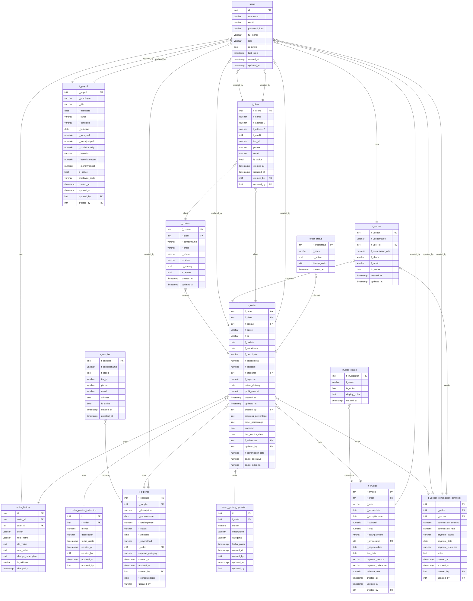

# Diagrama Entidad-Relación - Base de Datos IMA Mecatrónica
Generado: 2026-02-26 22:32:21

## Diagrama Completo

```mermaid
erDiagram
    app_versions {
        int4 id PK
        varchar version
        timestamp release_date
        bool is_latest
        bool is_mandatory
        text download_url
        numeric file_size_mb
        text release_notes
        varchar min_version
        varchar created_by
        bool is_active
        int4 downloads_count
        jsonb changelog
    }
    audit_log {
        int4 id PK
        int4 user_id FK
        varchar table_name
        varchar action
        int4 record_id
        jsonb old_values
        jsonb new_values
        varchar ip_address
        text user_agent
        timestamp created_at
    }
    invoice_audit {
        int4 id PK
        int4 invoice_id
        varchar action
        jsonb old_values
        jsonb new_values
        int4 user_id FK
        timestamp created_at
    }
    invoice_status {
        int4 f_invoicestat PK
        varchar f_name
        bool is_active
        int4 display_order
        timestamp created_at
    }
    order_gastos_indirectos {
        int4 id PK
        int4 f_order FK
        numeric monto
        varchar descripcion
        timestamp fecha_gasto
        timestamp created_at
        int4 created_by
        timestamp updated_at
        int4 updated_by
    }
    order_gastos_operativos {
        int4 id PK
        int4 f_order FK
        numeric monto
        varchar descripcion
        varchar categoria
        timestamp fecha_gasto
        timestamp created_at
        int4 created_by
        timestamp updated_at
        int4 updated_by
    }
    order_history {
        int4 id PK
        int4 order_id FK
        int4 user_id FK
        varchar action
        varchar field_name
        text old_value
        text new_value
        text change_description
        varchar ip_address
        timestamp changed_at
    }
    order_status {
        int4 f_orderstatus PK
        varchar f_name
        bool is_active
        int4 display_order
        timestamp created_at
    }
    t_attendance {
        int4 id PK
        int4 employee_id FK
        date attendance_date
        varchar status
        time check_in_time
        time check_out_time
        int4 late_minutes
        text notes
        bool is_justified
        text justification
        int4 created_by
        timestamp created_at
        int4 updated_by
        timestamp updated_at
    }
    t_attendance_audit {
        int4 id PK
        int4 attendance_id
        int4 employee_id
        date attendance_date
        varchar action
        varchar old_status
        time old_check_in_time
        time old_check_out_time
        int4 old_late_minutes
        text old_notes
        bool old_is_justified
        varchar new_status
        time new_check_in_time
        time new_check_out_time
        int4 new_late_minutes
        text new_notes
        bool new_is_justified
        int4 changed_by
        timestamp changed_at
        inet ip_address
        text user_agent
        text change_reason
    }
    t_balance_adjustments {
        int4 id PK
        int4 year
        int4 month
        varchar adjustment_type
        numeric original_amount
        numeric adjusted_amount
        numeric difference
        text reason
        int4 created_by FK
        timestamp created_at
    }
    t_client {
        int4 f_client PK
        varchar f_name
        varchar f_address1
        varchar f_address2
        int4 f_credit
        varchar tax_id
        varchar phone
        varchar email
        bool is_active
        timestamp created_at
        timestamp updated_at
        int4 created_by FK
        int4 updated_by FK
    }
    t_commission_rate_history {
        int4 id PK
        int4 order_id FK
        int4 vendor_id FK
        int4 commission_payment_id FK
        numeric old_rate
        numeric old_amount
        numeric new_rate
        numeric new_amount
        numeric order_subtotal
        varchar order_number
        varchar vendor_name
        int4 changed_by
        varchar changed_by_name
        timestamp changed_at
        text change_reason
        varchar ip_address
        bool is_vendor_removal
    }
    t_contact {
        int4 f_contact PK
        int4 f_client FK
        varchar f_contactname
        varchar f_email
        varchar f_phone
        varchar position
        bool is_primary
        bool is_active
        timestamp created_at
        timestamp updated_at
    }
    t_expense {
        int4 f_expense PK
        int4 f_supplier FK
        varchar f_description
        date f_expensedate
        numeric f_totalexpense
        varchar f_status
        date f_paiddate
        varchar f_paymethod
        int4 f_order FK
        varchar expense_category
        timestamp created_at
        timestamp updated_at
        int4 created_by FK
        date f_scheduleddate
        varchar updated_by
    }
    t_expense_audit {
        int4 id PK
        int4 expense_id
        varchar action
        int4 old_supplier_id
        text old_description
        numeric old_total_expense
        date old_expense_date
        date old_scheduled_date
        varchar old_status
        date old_paid_date
        varchar old_pay_method
        int4 old_order_id
        varchar old_expense_category
        text old_created_by
        varchar old_updated_by
        int4 new_supplier_id
        text new_description
        numeric new_total_expense
        date new_expense_date
        date new_scheduled_date
        varchar new_status
        date new_paid_date
        varchar new_pay_method
        int4 new_order_id
        varchar new_expense_category
        text new_created_by
        varchar new_updated_by
        timestamptz changed_at
        numeric amount_change
        int4 days_until_due_old
        int4 days_until_due_new
        varchar supplier_name
        varchar order_po
        varchar environment
    }
    t_fixed_expenses {
        int4 id PK
        varchar expense_type
        varchar description
        numeric monthly_amount
        bool is_active
        timestamp created_at
        timestamp updated_at
        int4 created_by FK
        date effective_date
    }
    t_fixed_expenses_history {
        int4 id PK
        int4 expense_id FK
        varchar description
        numeric monthly_amount
        date effective_date
        varchar change_type
        text change_summary
        int4 created_by FK
        timestamp created_at
    }
    t_holiday {
        int4 id PK
        date holiday_date
        varchar name
        text description
        bool is_mandatory
        bool is_recurring
        int4 recurring_month
        int4 recurring_day
        varchar recurring_rule
        int4 year
        int4 created_by
        timestamp created_at
        int4 updated_by
        timestamp updated_at
    }
    t_invoice {
        int4 f_invoice PK
        int4 f_order FK
        varchar f_folio
        date f_invoicedate
        date f_receptiondate
        numeric f_subtotal
        numeric f_total
        varchar f_downpayment
        int4 f_invoicestat FK
        date f_paymentdate
        date due_date
        varchar payment_method
        varchar payment_reference
        numeric balance_due
        timestamp created_at
        timestamp updated_at
        int4 created_by FK
    }
    t_order {
        int4 f_order PK
        int4 f_client FK
        int4 f_contact FK
        varchar f_quote
        varchar f_po
        date f_podate
        date f_estdelivery
        varchar f_description
        numeric f_salesubtotal
        numeric f_saletotal
        int4 f_orderstat FK
        numeric f_expense
        date actual_delivery
        numeric profit_amount
        timestamp created_at
        timestamp updated_at
        int4 created_by FK
        int4 progress_percentage
        int4 order_percentage
        bool invoiced
        date last_invoice_date
        int4 f_salesman FK
        int4 updated_by FK
        numeric f_commission_rate
        numeric gasto_operativo
        numeric gasto_indirecto
    }
    t_order_deleted {
        int4 id PK
        int4 original_order_id
        varchar f_po
        varchar f_quote
        int4 f_client
        int4 f_contact
        int4 f_salesman
        date f_podate
        date f_estdelivery
        text f_description
        numeric f_salesubtotal
        numeric f_saletotal
        int4 f_orderstat
        numeric f_expense
        int4 progress_percentage
        int4 order_percentage
        numeric f_commission_rate
        int4 deleted_by
        timestamp deleted_at
        text deletion_reason
        jsonb full_order_snapshot
    }
    t_overtime_hours {
        int4 id PK
        int4 year
        int4 month
        numeric amount
        text notes
        int4 created_by FK
        int4 updated_by FK
        timestamp created_at
        timestamp updated_at
    }
    t_overtime_hours_audit {
        int4 id PK
        int4 overtime_id
        int4 year
        int4 month
        numeric old_amount
        numeric new_amount
        varchar change_type
        text change_reason
        int4 changed_by FK
        timestamp changed_at
        varchar ip_address
        text user_agent
    }
    t_payroll {
        int4 f_payroll PK
        varchar f_employee
        varchar f_title
        date f_hireddate
        varchar f_range
        varchar f_condition
        date f_lastraise
        numeric f_sspayroll
        numeric f_weeklypayroll
        numeric f_socialsecurity
        varchar f_benefits
        numeric f_benefitsamount
        numeric f_monthlypayroll
        bool is_active
        varchar employee_code
        timestamp created_at
        timestamp updated_at
        int4 updated_by FK
        int4 created_by FK
    }
    t_payroll_history {
        int4 id PK
        int4 f_payroll FK
        varchar f_employee
        varchar f_title
        date f_hireddate
        varchar f_range
        varchar f_condition
        date f_lastraise
        numeric f_sspayroll
        numeric f_weeklypayroll
        numeric f_socialsecurity
        varchar f_benefits
        numeric f_benefitsamount
        numeric f_monthlypayroll
        varchar employee_code
        bool is_active
        jsonb changed_fields
        date effective_date
        varchar change_type
        text change_summary
        int4 created_by FK
        timestamp created_at
    }
    t_payrollovertime {
        int4 f_payrollovertime PK
        date f_date
        numeric f_payroll
        numeric f_overtime
        numeric f_fixedexpense
        int4 f_estimate
        int4 employee_id FK
        numeric hours_worked
        timestamp created_at
        int4 created_by FK
    }
    t_supplier {
        int4 f_supplier PK
        varchar f_suppliername
        int4 f_credit
        varchar tax_id
        varchar phone
        varchar email
        text address
        bool is_active
        timestamp created_at
        timestamp updated_at
    }
    t_vacation {
        int4 id PK
        int4 employee_id FK
        date start_date
        date end_date
        int4 total_days
        text notes
        varchar status
        int4 approved_by
        timestamp approved_at
        text rejection_reason
        int4 created_by
        timestamp created_at
        int4 updated_by
        timestamp updated_at
    }
    t_vacation_audit {
        int4 id PK
        int4 vacation_id
        int4 employee_id
        varchar action
        date old_start_date
        date old_end_date
        varchar old_status
        text old_notes
        date new_start_date
        date new_end_date
        varchar new_status
        text new_notes
        int4 changed_by
        timestamp changed_at
        text change_reason
    }
    t_vendor {
        int4 f_vendor PK
        varchar f_vendorname
        int4 f_user_id FK
        numeric f_commission_rate
        varchar f_phone
        varchar f_email
        bool is_active
        timestamp created_at
        timestamp updated_at
    }
    t_vendor_commission_payment {
        int4 id PK
        int4 f_order FK
        int4 f_vendor FK
        numeric commission_amount
        numeric commission_rate
        varchar payment_status
        date payment_date
        varchar payment_reference
        text notes
        timestamp created_at
        timestamp updated_at
        int4 created_by FK
        int4 updated_by FK
    }
    t_workday_config {
        int4 id PK
        int4 day_of_week
        bool is_workday
        varchar description
        timestamp created_at
        timestamp updated_at
    }
    users {
        int4 id PK
        varchar username
        varchar email
        varchar password_hash
        varchar full_name
        varchar role
        bool is_active
        timestamp last_login
        timestamp created_at
        timestamp updated_at
    }

    users }o--|| audit_log : "user"
    users }o--|| invoice_audit : "user"
    t_order }|--|| order_gastos_indirectos : "order"
    t_order }|--|| order_gastos_operativos : "order"
    t_order }|--|| order_history : "order"
    users }|--|| order_history : "user"
    t_payroll }|--|| t_attendance : "employee"
    users }o--|| t_balance_adjustments : "created_by"
    users }o--|| t_client : "updated_by"
    users }o--|| t_client : "created_by"
    t_vendor }|--|| t_commission_rate_history : "vendor"
    t_vendor_commission_payment }o--|| t_commission_rate_history : "commission_payment"
    t_order }|--|| t_commission_rate_history : "order"
    t_client }o--|| t_contact : "client"
    users }o--|| t_expense : "created_by"
    t_order }o--|| t_expense : "order"
    t_supplier }o--|| t_expense : "supplier"
    users }o--|| t_fixed_expenses : "created_by"
    users }o--|| t_fixed_expenses_history : "created_by"
    t_fixed_expenses }o--|| t_fixed_expenses_history : "expense"
    users }o--|| t_invoice : "created_by"
    t_order }o--|| t_invoice : "order"
    invoice_status }o--|| t_invoice : "invoicestat"
    order_status }o--|| t_order : "orderstat"
    users }o--|| t_order : "created_by"
    t_client }o--|| t_order : "client"
    t_vendor }o--|| t_order : "salesman"
    users }o--|| t_order : "updated_by"
    t_contact }o--|| t_order : "contact"
    users }o--|| t_overtime_hours : "created_by"
    users }o--|| t_overtime_hours : "updated_by"
    users }o--|| t_overtime_hours_audit : "changed_by"
    users }o--|| t_payroll : "updated_by"
    users }o--|| t_payroll : "created_by"
    users }o--|| t_payroll_history : "created_by"
    t_payroll }o--|| t_payroll_history : "payroll"
    t_payroll }o--|| t_payrollovertime : "employee"
    users }o--|| t_payrollovertime : "created_by"
    t_payroll }|--|| t_vacation : "employee"
    users }o--|| t_vendor : "user"
    t_vendor }|--|| t_vendor_commission_payment : "vendor"
    users }o--|| t_vendor_commission_payment : "created_by"
    users }o--|| t_vendor_commission_payment : "updated_by"
    t_order }|--|| t_vendor_commission_payment : "order"
```

## Diagrama Simplificado (Tablas Core)

## Diagrama por Módulos Funcionales

### Ventas/Órdenes
Tablas: `t_order`, `t_client`, `t_contact`, `t_vendor`, `order_status`, `order_history`, `order_gastos_operativos`, `order_gastos_indirectos`, `t_order_deleted`

### Facturación
Tablas: `t_invoice`, `invoice_status`, `invoice_audit`

### Gastos
Tablas: `t_expense`, `t_expense_audit`, `t_fixed_expenses`, `t_fixed_expenses_history`

### Nómina/RRHH
Tablas: `t_payroll`, `t_payroll_history`, `t_payrollovertime`, `t_overtime_hours`, `t_overtime_hours_audit`, `t_attendance`, `t_attendance_audit`, `t_vacation`, `t_vacation_audit`, `t_holiday`, `t_workday_config`

### Comisiones
Tablas: `t_vendor`, `t_vendor_commission_payment`, `t_commission_rate_history`

### Sistema
Tablas: `users`, `audit_log`, `app_versions`, `t_supplier`, `t_balance_adjustments`
