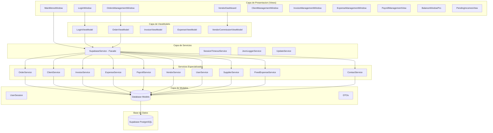
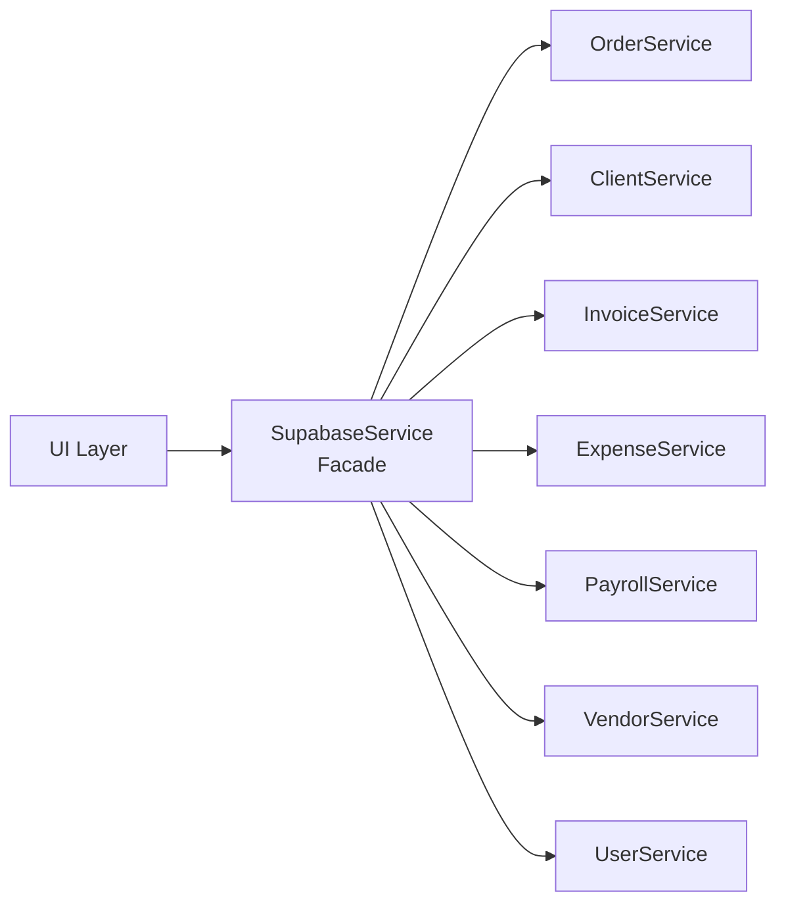
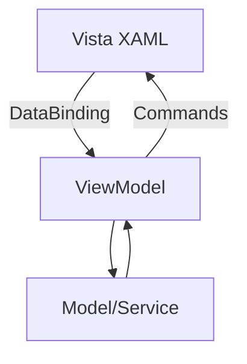
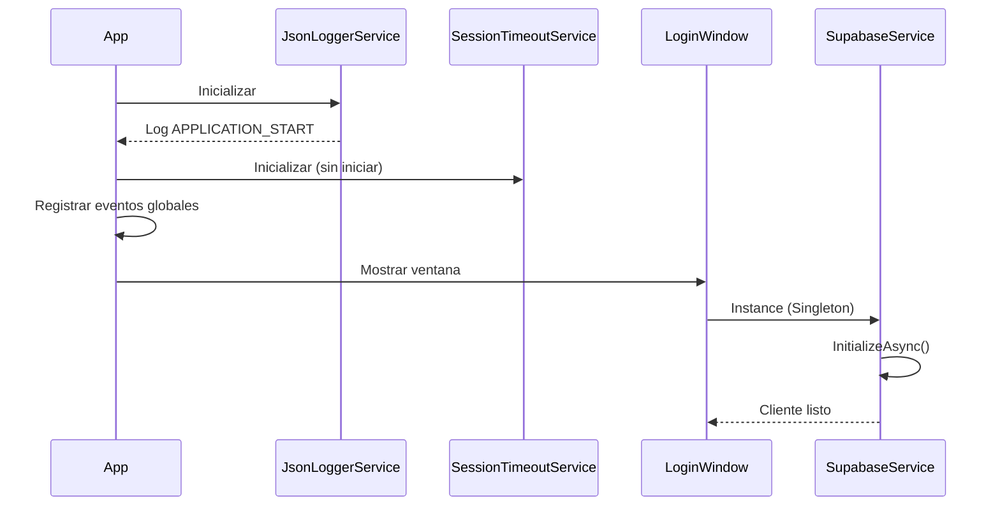

# Arquitectura del Sistema de Gestion de Proyectos

## Informacion General

| Atributo | Valor |
|----------|-------|
| **Nombre** | Sistema de Gestion de Proyectos |
| **Version** | 1.0.9 |
| **Framework** | .NET 8.0 (WPF) |
| **Base de Datos** | Supabase (PostgreSQL) |
| **Empresa** | IMA Mecatronica |
| **Copyright** | 2025 Zuri Dev |

## Vision General de la Arquitectura

El sistema sigue una arquitectura de **capas** con el patron **Facade** para la gestion de servicios, implementando principios SOLID y patrones de diseno como Singleton y Repository.



## Estructura de Carpetas

```
SistemaGestionProyectos2/
├── App.xaml                    # Configuracion de la aplicacion
├── App.xaml.cs                 # Logica de inicio y manejo de eventos globales
├── appsettings.json           # Configuracion (Supabase, SessionTimeout)
├── AssemblyInfo.cs            # Metadatos del ensamblado
│
├── Controls/                   # Controles personalizados
│   └── SessionTimeoutBanner.xaml
│
├── Models/                     # Modelos de datos
│   ├── Database/              # Modelos ORM para Supabase
│   │   ├── OrderDb.cs
│   │   ├── ClientDb.cs
│   │   ├── ContactDb.cs
│   │   ├── InvoiceDb.cs
│   │   ├── ExpenseDb.cs
│   │   ├── SupplierDb.cs
│   │   ├── PayrollDb.cs
│   │   ├── FixedExpenseDb.cs
│   │   ├── VendorDb.cs
│   │   ├── UserDb.cs
│   │   ├── StatusDb.cs
│   │   ├── HistoryDb.cs
│   │   └── AppVersionDb.cs
│   │
│   ├── DTOs/                  # Data Transfer Objects
│   │   ├── OrderDTOs.cs
│   │   ├── InvoiceDTOs.cs
│   │   └── ExpenseDTOs.cs
│   │
│   ├── UserSession.cs         # Sesion de usuario activo
│   ├── OrderViewModel.cs      # ViewModel para ordenes
│   ├── InvoiceViewModel.cs    # ViewModel para facturas
│   ├── PayrollModels.cs       # Modelos de nomina
│   └── DataModels.cs          # Modelos auxiliares
│
├── Services/                   # Capa de servicios
│   ├── Core/
│   │   └── BaseSupabaseService.cs  # Clase base para servicios
│   │
│   ├── Orders/
│   │   └── OrderService.cs
│   ├── Clients/
│   │   └── ClientService.cs
│   ├── Contacts/
│   │   └── ContactService.cs
│   ├── Invoices/
│   │   └── InvoiceService.cs
│   ├── Expenses/
│   │   └── ExpenseService.cs
│   ├── Suppliers/
│   │   └── SupplierService.cs
│   ├── Payroll/
│   │   └── PayrollService.cs
│   ├── FixedExpenses/
│   │   └── FixedExpenseService.cs
│   ├── Vendors/
│   │   └── VendorService.cs
│   ├── Users/
│   │   └── UserService.cs
│   ├── Updates/
│   │   └── UpdateService.cs
│   │
│   ├── SupabaseService.cs     # Facade principal
│   ├── SessionTimeoutService.cs
│   ├── JsonLoggerService.cs
│   ├── AuthenticationService.cs
│   ├── RoleToVisibilityConverter.cs
│   ├── AdminVisibilityConverter.cs
│   └── PercentageConverter.cs
│
├── ViewModels/                 # ViewModels MVVM
│   ├── BaseViewModel.cs
│   ├── LoginViewModel.cs
│   ├── MainViewModel.cs
│   ├── ProyectoViewModel.cs
│   ├── ExpenseViewModel.cs
│   ├── VendorCommissionViewModel.cs
│   └── SupplierExpensesSummaryViewModel.cs
│
├── Views/                      # Vistas XAML
│   ├── LoginWindow.xaml
│   ├── LoadingWindow.xaml
│   ├── MainMenuWindow.xaml
│   ├── OrdersManagementWindow.xaml
│   ├── NewOrderWindow.xaml
│   ├── EditOrderWindow.xaml
│   ├── ClientManagementWindow.xaml
│   ├── NewClientWindow.xaml
│   ├── InvoiceManagementWindow.xaml
│   ├── ExpenseManagementWindow.xaml
│   ├── SupplierManagementWindow.xaml
│   ├── PayrollManagementView.xaml
│   ├── PayrollHistoryWindow.xaml
│   ├── EmployeeEditWindow.xaml
│   ├── VendorManagementWindow.xaml
│   ├── VendorCommissionsWindow.xaml
│   ├── VendorEditDialog.xaml
│   ├── VendorDashboard.xaml
│   ├── BalanceWindowPro.xaml
│   ├── PendingIncomesView.xaml
│   ├── PendingIncomesDetailView.xaml
│   ├── GanttView.xaml
│   ├── UpdateAvailableWindow.xaml
│   ├── SessionTimeoutWarningWindow.xaml
│   └── SupabaseTestWindow.xaml
│
├── Tests/                      # Pruebas
│   └── SupabaseServiceIntegrationTests.cs
│
└── installer.iss              # Script Inno Setup
```

## Patrones de Diseno Implementados

### 1. Singleton Pattern
Utilizado para servicios que requieren una unica instancia:

```csharp
// SupabaseService.cs
public static SupabaseService Instance
{
    get
    {
        if (_instance == null)
        {
            lock (_lock)
            {
                if (_instance == null)
                {
                    _instance = new SupabaseService();
                }
            }
        }
        return _instance;
    }
}
```

### 2. Facade Pattern
El `SupabaseService` actua como fachada que unifica el acceso a todos los servicios especializados:



### 3. Repository Pattern
Cada servicio especializado actua como repositorio para su entidad:

```csharp
// BaseSupabaseService.cs
public abstract class BaseSupabaseService
{
    protected Client SupabaseClient { get; private set; }

    protected void LogDebug(string message);
    protected void LogError(string message, Exception ex);
    protected void LogSuccess(string message);
}
```

### 4. MVVM (Model-View-ViewModel)
Separacion clara entre la logica de UI y la logica de negocio:



## Flujo de Inicio de la Aplicacion



## Dependencias Principales

| Paquete | Version | Proposito |
|---------|---------|-----------|
| supabase-csharp | 0.16.2 | Cliente Supabase para .NET |
| BCrypt.Net-Next | 4.0.3 | Hashing seguro de contrasenas |
| Microsoft.Extensions.Configuration.Json | 9.0.8 | Configuracion JSON |
| Microsoft.Extensions.Configuration.Binder | 9.0.8 | Binding de configuracion |

## Proximos Documentos

- [02_MODELOS_DATOS.md](./02_MODELOS_DATOS.md) - Modelos y esquema de base de datos
- [03_SERVICIOS.md](./03_SERVICIOS.md) - Documentacion de servicios
- [04_ROLES_AUTENTICACION.md](./04_ROLES_AUTENTICACION.md) - Sistema de roles y permisos
- [05_FLUJOS_TRABAJO.md](./05_FLUJOS_TRABAJO.md) - Flujos de trabajo y procesos
