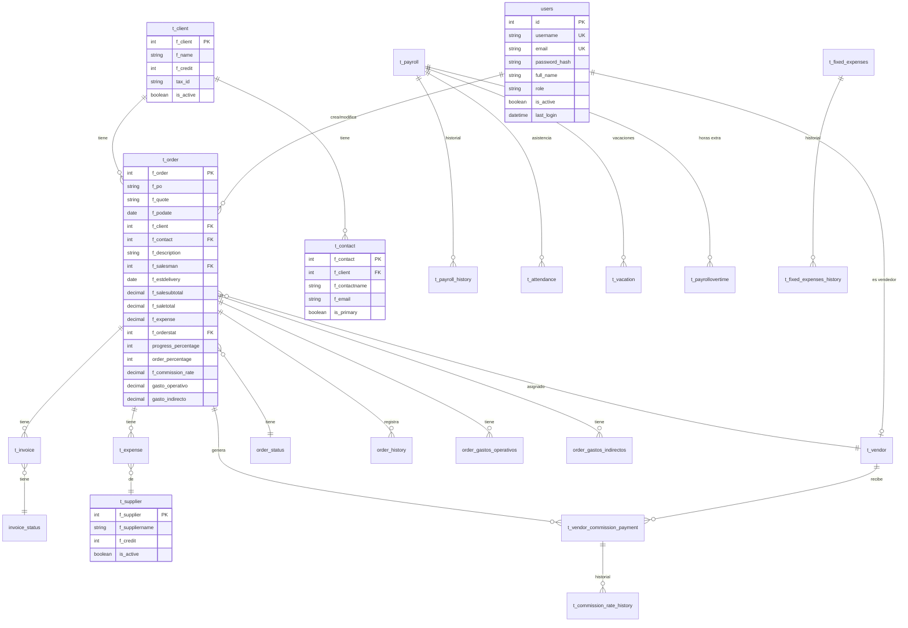
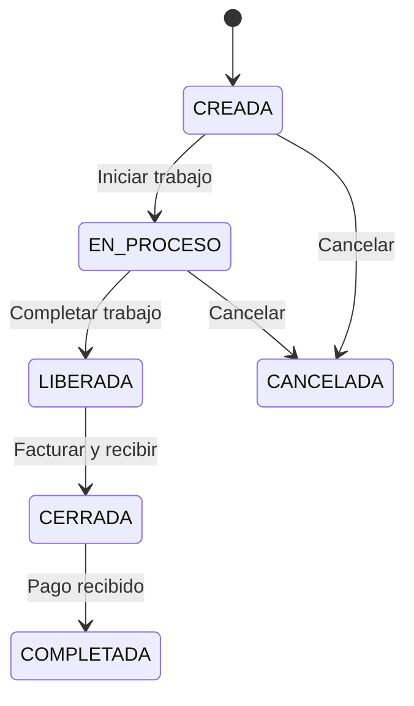

# Modelos y Esquema de Base de Datos

**Fecha de actualización:** 26 de Enero de 2026
**Total de tablas:** 33
**Total de vistas:** 10

---

## Resumen de Tablas

| Categoría | Tablas | Descripción |
|-----------|--------|-------------|
| **Core (Órdenes)** | 6 | t_order, order_status, order_history, order_gastos_operativos, order_gastos_indirectos, t_order_deleted |
| **Clientes** | 2 | t_client, t_contact |
| **Facturación** | 3 | t_invoice, invoice_status, invoice_audit |
| **Gastos/Proveedores** | 2 | t_expense, t_supplier |
| **Comisiones** | 3 | t_vendor, t_vendor_commission_payment, t_commission_rate_history |
| **Nómina/RRHH** | 5 | t_payroll, t_payroll_history, t_overtime_hours, t_overtime_hours_audit, t_payrollovertime |
| **Calendario** | 6 | t_attendance, t_attendance_audit, t_vacation, t_vacation_audit, t_holiday, t_workday_config |
| **Balance** | 3 | t_fixed_expenses, t_fixed_expenses_history, t_balance_adjustments |
| **Sistema** | 3 | users, app_versions, audit_log |

---

## Diagrama Entidad-Relación (ERD)



---

## 1. TABLAS DEL SISTEMA

### 1.1 users - Usuarios del Sistema

| Columna | Tipo | Nullable | Default | Descripción |
|---------|------|----------|---------|-------------|
| id | int (PK) | NO | autoincrement | Identificador único |
| username | varchar | NO | - | Nombre de usuario (UNIQUE) |
| email | varchar | NO | - | Correo electrónico (UNIQUE) |
| password_hash | varchar | NO | - | Hash BCrypt de la contraseña |
| full_name | varchar | NO | - | Nombre completo |
| role | varchar | NO | - | Rol del usuario |
| is_active | boolean | YES | true | Estado activo/inactivo |
| last_login | timestamp | YES | - | Último inicio de sesión |
| created_at | timestamp | YES | CURRENT_TIMESTAMP | Fecha de creación |
| updated_at | timestamp | YES | CURRENT_TIMESTAMP | Fecha de modificación |

**Roles disponibles (v2.0):**

| Rol | Descripción | Acceso |
|-----|-------------|--------|
| `direccion` | Dirección general | Acceso total + gastos detallados |
| `administracion` | Administración | Acceso total sin gastos detallados |
| `proyectos` | Gestión de proyectos | Órdenes (estados 0-2) |
| `coordinacion` | Coordinación | Similar a proyectos |
| `ventas` | Vendedores | Portal de comisiones |

```sql
-- Constraint de roles
CHECK (role IN ('direccion', 'administracion', 'proyectos', 'coordinacion', 'ventas'))
```

---

### 1.2 app_versions - Control de Versiones de la Aplicación

| Columna | Tipo | Nullable | Default | Descripción |
|---------|------|----------|---------|-------------|
| id | int (PK) | NO | autoincrement | ID de la versión |
| version | varchar | NO | - | Número de versión (UNIQUE, formato X.Y.Z) |
| release_date | timestamp | NO | now() | Fecha de liberación |
| is_latest | boolean | NO | false | Si es la versión más reciente |
| is_mandatory | boolean | NO | false | Si la actualización es obligatoria |
| download_url | text | NO | - | URL de descarga del instalador |
| file_size_mb | numeric | YES | - | Tamaño del archivo en MB |
| release_notes | text | YES | - | Notas de la versión |
| min_version | varchar | YES | - | Versión mínima requerida para actualizar |
| created_by | varchar | YES | - | Usuario que creó la versión |
| is_active | boolean | NO | true | Si la versión está activa |
| downloads_count | int | YES | 0 | Contador de descargas |
| changelog | jsonb | YES | - | Cambios detallados en formato JSON |

```sql
-- Constraint de formato de versión
CHECK (version ~ '^\d+\.\d+\.\d+$')
```

---

### 1.3 audit_log - Log General de Auditoría

| Columna | Tipo | Nullable | Default | Descripción |
|---------|------|----------|---------|-------------|
| id | int (PK) | NO | autoincrement | ID del registro |
| user_id | int (FK) | YES | - | Usuario que realizó la acción |
| table_name | varchar | YES | - | Tabla afectada |
| action | varchar | YES | - | Acción realizada (INSERT/UPDATE/DELETE) |
| record_id | int | YES | - | ID del registro afectado |
| old_values | jsonb | YES | - | Valores anteriores |
| new_values | jsonb | YES | - | Valores nuevos |
| ip_address | varchar | YES | - | Dirección IP del usuario |
| user_agent | text | YES | - | User agent del navegador/app |
| created_at | timestamp | YES | CURRENT_TIMESTAMP | Fecha del evento |

**FK:** `user_id` → `users(id)`

---

## 2. TABLAS CORE - ÓRDENES

### 2.1 t_order - Órdenes/Proyectos (CORE)

| Columna | Tipo | Nullable | Default | Descripción |
|---------|------|----------|---------|-------------|
| f_order | int (PK) | NO | autoincrement | ID de la orden |
| f_po | varchar | YES | - | Número de Purchase Order |
| f_quote | varchar | YES | - | Número de cotización |
| f_podate | date | YES | - | Fecha de la orden |
| f_client | int (FK) | YES | - | Cliente asociado |
| f_contact | int (FK) | YES | - | Contacto del cliente |
| f_description | varchar | YES | - | Descripción del proyecto |
| f_salesman | int (FK) | YES | - | Vendedor asignado |
| f_estdelivery | date | YES | - | Fecha estimada de entrega |
| actual_delivery | date | YES | - | Fecha de entrega real |
| f_salesubtotal | numeric | YES | 0 | Subtotal de venta |
| f_saletotal | numeric | YES | 0 | Total de venta (con IVA) |
| f_expense | numeric | YES | 0 | Gastos material (legacy) |
| f_orderstat | int (FK) | YES | 0 | Estado de la orden |
| progress_percentage | int | YES | 0 | Porcentaje de progreso (0-100) |
| order_percentage | int | YES | 0 | Porcentaje de orden |
| f_commission_rate | numeric | YES | 0 | Tasa de comisión (%) |
| gasto_operativo | numeric | YES | 0 | Suma de gastos operativos (v2.0) |
| gasto_indirecto | numeric | YES | 0 | Suma de gastos indirectos (v2.1) |
| invoiced | boolean | YES | false | Si está facturada |
| last_invoice_date | date | YES | - | Fecha de última factura |
| profit_amount | numeric | YES | calculado | Utilidad (saletotal - expense) |
| created_by | int (FK) | YES | - | Usuario que creó |
| updated_by | int (FK) | YES | - | Usuario que modificó |
| created_at | timestamp | YES | CURRENT_TIMESTAMP | Fecha de creación |
| updated_at | timestamp | YES | CURRENT_TIMESTAMP | Fecha de modificación |

**Foreign Keys:**
- `f_client` → `t_client(f_client)`
- `f_contact` → `t_contact(f_contact)`
- `f_orderstat` → `order_status(f_orderstatus)`
- `f_salesman` → `t_vendor(f_vendor)`
- `created_by` → `users(id)`
- `updated_by` → `users(id)`

**Constraints:**
```sql
CHECK (progress_percentage >= 0 AND progress_percentage <= 100)
CHECK (order_percentage >= 0 AND order_percentage <= 100)
```

---

### 2.2 order_status - Estados de Órdenes

| Columna | Tipo | Nullable | Default | Descripción |
|---------|------|----------|---------|-------------|
| f_orderstatus | int (PK) | NO | autoincrement | ID del estado |
| f_name | varchar | NO | - | Nombre del estado |
| is_active | boolean | YES | true | Si está activo |
| display_order | int | YES | 0 | Orden de visualización |
| created_at | timestamp | YES | CURRENT_TIMESTAMP | Fecha de creación |

**Estados del Sistema:**

| ID | Nombre | Descripción | Acciones Permitidas |
|----|--------|-------------|---------------------|
| 0 | CREADA | Orden recién creada | Editar, Cancelar, Eliminar |
| 1 | EN PROCESO | Orden en trabajo | Editar, Facturar parcial |
| 2 | LIBERADA | Lista para facturar | Facturar |
| 3 | CERRADA | Facturada y recibida | Registrar pagos |
| 4 | COMPLETADA | Pagada completamente | Solo lectura |
| 5 | CANCELADA | Orden cancelada | Solo lectura |



---

### 2.3 order_history - Historial de Cambios en Órdenes

| Columna | Tipo | Nullable | Default | Descripción |
|---------|------|----------|---------|-------------|
| id | int (PK) | NO | autoincrement | ID del registro |
| order_id | int (FK) | NO | - | Orden afectada |
| user_id | int (FK) | NO | - | Usuario que hizo el cambio |
| action | varchar | NO | - | Tipo de acción (CREATE/UPDATE/DELETE) |
| field_name | varchar | YES | - | Campo modificado |
| old_value | text | YES | - | Valor anterior |
| new_value | text | YES | - | Valor nuevo |
| change_description | text | YES | - | Descripción del cambio |
| ip_address | varchar | YES | - | IP del usuario |
| changed_at | timestamp | YES | CURRENT_TIMESTAMP | Fecha del cambio |

**Foreign Keys:**
- `order_id` → `t_order(f_order)` (CASCADE DELETE)
- `user_id` → `users(id)`

---

### 2.4 order_gastos_operativos - Gastos Operativos por Orden (v2.0)

| Columna | Tipo | Nullable | Default | Descripción |
|---------|------|----------|---------|-------------|
| id | int (PK) | NO | autoincrement | ID del gasto |
| f_order | int (FK) | NO | - | Orden asociada |
| monto | numeric | NO | 0 | Monto BASE del gasto (sin comisión) |
| descripcion | varchar | NO | - | Descripción del gasto |
| categoria | varchar | YES | - | Categoría (fletes, viáticos, etc.) |
| fecha_gasto | timestamp | YES | CURRENT_TIMESTAMP | Fecha del gasto |
| created_at | timestamp | YES | CURRENT_TIMESTAMP | Fecha de creación |
| created_by | int (FK) | YES | - | Usuario que creó |
| updated_at | timestamp | YES | CURRENT_TIMESTAMP | Fecha de modificación |
| updated_by | int (FK) | YES | - | Usuario que modificó |
| **f_commission_rate** | **numeric** | **YES** | **0** | **Snapshot del % de comisión del vendedor** *(Nueva 2026-02-06)* |

**FK:** `f_order` → `t_order(f_order)`

**Trigger:** `trg_recalcular_gasto_operativo` - Al insertar/editar/eliminar, recalcula automáticamente `t_order.gasto_operativo` como `SUM(monto * (1 + f_commission_rate/100))`.

**Nota:** El campo `monto` almacena el valor BASE (lo que el usuario escribe). La comisión se aplica en el cálculo del trigger, no se multiplica antes de guardar.

---

### 2.5 order_gastos_indirectos - Gastos Indirectos por Orden (v2.1)

| Columna | Tipo | Nullable | Default | Descripción |
|---------|------|----------|---------|-------------|
| id | int (PK) | NO | autoincrement | ID del gasto |
| f_order | int (FK) | NO | - | Orden asociada |
| monto | numeric | NO | - | Monto del gasto |
| descripcion | varchar | NO | - | Descripción del gasto |
| fecha_gasto | timestamp | YES | CURRENT_TIMESTAMP | Fecha del gasto |
| created_at | timestamp | YES | CURRENT_TIMESTAMP | Fecha de creación |
| created_by | int (FK) | YES | - | Usuario que creó |
| updated_at | timestamp | YES | - | Fecha de modificación |
| updated_by | int (FK) | YES | - | Usuario que modificó |

**FK:** `f_order` → `t_order(f_order)`

**Nota:** La suma se sincroniza automáticamente a `t_order.gasto_indirecto`.

---

### 2.6 t_order_deleted - Auditoría de Órdenes Eliminadas

| Columna | Tipo | Nullable | Default | Descripción |
|---------|------|----------|---------|-------------|
| id | int (PK) | NO | autoincrement | ID del registro |
| original_order_id | int | NO | - | ID original de la orden |
| f_po | varchar | YES | - | Número de PO |
| f_quote | varchar | YES | - | Número de cotización |
| f_client | int | YES | - | ID del cliente |
| f_contact | int | YES | - | ID del contacto |
| f_salesman | int | YES | - | ID del vendedor |
| f_podate | date | YES | - | Fecha de la orden |
| f_estdelivery | date | YES | - | Fecha estimada |
| f_description | text | YES | - | Descripción |
| f_salesubtotal | numeric | YES | - | Subtotal |
| f_saletotal | numeric | YES | - | Total |
| f_orderstat | int | YES | - | Estado |
| f_expense | numeric | YES | - | Gastos |
| progress_percentage | int | YES | - | % Progreso |
| order_percentage | int | YES | - | % Orden |
| f_commission_rate | numeric | YES | - | Tasa comisión |
| deleted_by | int (FK) | NO | - | Usuario que eliminó |
| deleted_at | timestamp | YES | CURRENT_TIMESTAMP | Fecha de eliminación |
| deletion_reason | text | YES | - | Motivo de eliminación |
| full_order_snapshot | jsonb | YES | - | Snapshot completo en JSON |

---

## 3. TABLAS DE CLIENTES

### 3.1 t_client - Clientes

| Columna | Tipo | Nullable | Default | Descripción |
|---------|------|----------|---------|-------------|
| f_client | int (PK) | NO | autoincrement | ID del cliente |
| f_name | varchar | NO | - | Nombre del cliente |
| f_address1 | varchar | YES | - | Dirección línea 1 |
| f_address2 | varchar | YES | - | Dirección línea 2 |
| f_credit | int | YES | 0 | Días de crédito |
| tax_id | varchar | YES | - | RFC/Tax ID |
| phone | varchar | YES | - | Teléfono |
| email | varchar | YES | - | Email |
| is_active | boolean | YES | true | Estado activo |
| created_at | timestamp | YES | CURRENT_TIMESTAMP | Fecha de creación |
| updated_at | timestamp | YES | CURRENT_TIMESTAMP | Fecha de modificación |
| created_by | int (FK) | YES | - | Usuario que creó |
| updated_by | int (FK) | YES | - | Usuario que modificó |

**Foreign Keys:**
- `created_by` → `users(id)`
- `updated_by` → `users(id)`

---

### 3.2 t_contact - Contactos de Clientes

| Columna | Tipo | Nullable | Default | Descripción |
|---------|------|----------|---------|-------------|
| f_contact | int (PK) | NO | autoincrement | ID del contacto |
| f_client | int (FK) | YES | - | Cliente al que pertenece |
| f_contactname | varchar | YES | - | Nombre del contacto |
| f_email | varchar | YES | - | Email del contacto |
| f_phone | varchar | YES | - | Teléfono del contacto |
| position | varchar | YES | - | Puesto/cargo |
| is_primary | boolean | YES | false | Si es contacto principal |
| is_active | boolean | YES | true | Estado activo |
| created_at | timestamp | YES | CURRENT_TIMESTAMP | Fecha de creación |
| updated_at | timestamp | YES | CURRENT_TIMESTAMP | Fecha de modificación |

**FK:** `f_client` → `t_client(f_client)`

---

## 4. TABLAS DE FACTURACIÓN

### 4.1 t_invoice - Facturas

| Columna | Tipo | Nullable | Default | Descripción |
|---------|------|----------|---------|-------------|
| f_invoice | int (PK) | NO | autoincrement | ID de factura |
| f_order | int (FK) | YES | - | Orden asociada |
| f_folio | varchar | YES | - | Número de folio |
| f_invoicedate | date | YES | - | Fecha de facturación |
| f_receptiondate | date | YES | - | Fecha de recepción |
| f_subtotal | numeric | YES | 0 | Subtotal |
| f_total | numeric | YES | 0 | Total |
| f_downpayment | varchar | YES | - | Anticipo |
| f_invoicestat | int (FK) | YES | - | Estado de la factura |
| f_paymentdate | date | YES | - | Fecha de pago |
| due_date | date | YES | - | Fecha de vencimiento |
| payment_method | varchar | YES | - | Método de pago |
| payment_reference | varchar | YES | - | Referencia del pago |
| balance_due | numeric | YES | - | Saldo pendiente |
| created_at | timestamp | YES | CURRENT_TIMESTAMP | Fecha de creación |
| updated_at | timestamp | YES | CURRENT_TIMESTAMP | Fecha de modificación |
| created_by | int (FK) | YES | - | Usuario que creó |

**Foreign Keys:**
- `f_order` → `t_order(f_order)`
- `f_invoicestat` → `invoice_status(f_invoicestat)`
- `created_by` → `users(id)`

---

### 4.2 invoice_status - Estados de Facturas

| Columna | Tipo | Nullable | Default | Descripción |
|---------|------|----------|---------|-------------|
| f_invoicestat | int (PK) | NO | autoincrement | ID del estado |
| f_name | varchar | NO | - | Nombre del estado |
| is_active | boolean | YES | true | Si está activo |
| display_order | int | YES | 0 | Orden de visualización |
| created_at | timestamp | YES | CURRENT_TIMESTAMP | Fecha de creación |

**Estados del Sistema:**

| ID | Nombre | Descripción |
|----|--------|-------------|
| 1 | PENDIENTE | Factura pendiente de pago |
| 2 | ENVIADA | Factura enviada al cliente |
| 3 | VENCIDA | Factura con fecha vencida |
| 4 | PAGADA | Factura pagada completamente |

---

### 4.3 invoice_audit - Auditoría de Facturas

| Columna | Tipo | Nullable | Default | Descripción |
|---------|------|----------|---------|-------------|
| id | int (PK) | NO | autoincrement | ID del registro |
| invoice_id | int | YES | - | ID de la factura |
| action | varchar | YES | - | Acción realizada |
| old_values | jsonb | YES | - | Valores anteriores |
| new_values | jsonb | YES | - | Valores nuevos |
| user_id | int (FK) | YES | - | Usuario que realizó la acción |
| created_at | timestamp | YES | CURRENT_TIMESTAMP | Fecha del evento |

**FK:** `user_id` → `users(id)`

---

## 5. TABLAS DE GASTOS Y PROVEEDORES

### 5.1 t_expense - Gastos a Proveedores

| Columna | Tipo | Nullable | Default | Descripción |
|---------|------|----------|---------|-------------|
| f_expense | int (PK) | NO | autoincrement | ID del gasto |
| f_supplier | int (FK) | YES | - | Proveedor |
| f_description | varchar | YES | - | Descripción |
| f_expensedate | date | YES | - | Fecha del gasto |
| f_totalexpense | numeric | YES | 0 | Monto total |
| f_scheduleddate | date | YES | - | Fecha programada de pago |
| f_status | varchar | YES | - | Estado (PENDIENTE/PAGADO) |
| f_paiddate | date | YES | - | Fecha de pago real |
| f_paymethod | varchar | YES | - | Método de pago |
| f_order | int (FK) | YES | - | Orden asociada (opcional) |
| expense_category | varchar | YES | - | Categoría del gasto |
| created_at | timestamp | YES | CURRENT_TIMESTAMP | Fecha de creación |
| updated_at | timestamp | YES | CURRENT_TIMESTAMP | Fecha de modificación |
| created_by | int (FK) | YES | - | Usuario que creó |

**Foreign Keys:**
- `f_supplier` → `t_supplier(f_supplier)`
- `f_order` → `t_order(f_order)`
- `created_by` → `users(id)`

---

### 5.2 t_supplier - Proveedores

| Columna | Tipo | Nullable | Default | Descripción |
|---------|------|----------|---------|-------------|
| f_supplier | int (PK) | NO | autoincrement | ID del proveedor |
| f_suppliername | varchar | NO | - | Nombre del proveedor |
| f_credit | int | YES | 0 | Días de crédito |
| tax_id | varchar | YES | - | RFC/Tax ID |
| phone | varchar | YES | - | Teléfono |
| email | varchar | YES | - | Email |
| address | text | YES | - | Dirección |
| is_active | boolean | YES | true | Estado activo |
| created_at | timestamp | YES | CURRENT_TIMESTAMP | Fecha de creación |
| updated_at | timestamp | YES | CURRENT_TIMESTAMP | Fecha de modificación |

---

## 6. TABLAS DE COMISIONES

### 6.1 t_vendor - Vendedores

| Columna | Tipo | Nullable | Default | Descripción |
|---------|------|----------|---------|-------------|
| f_vendor | int (PK) | NO | autoincrement | ID del vendedor |
| f_vendorname | varchar | NO | - | Nombre del vendedor |
| f_user_id | int (FK) | YES | - | Usuario asociado |
| f_commission_rate | numeric | YES | 0 | Tasa de comisión por defecto (%) |
| f_phone | varchar | YES | - | Teléfono |
| f_email | varchar | YES | - | Email |
| is_active | boolean | YES | true | Estado activo |
| created_at | timestamp | YES | CURRENT_TIMESTAMP | Fecha de creación |
| updated_at | timestamp | YES | CURRENT_TIMESTAMP | Fecha de modificación |

**FK:** `f_user_id` → `users(id)`

---

### 6.2 t_vendor_commission_payment - Pagos de Comisiones

| Columna | Tipo | Nullable | Default | Descripción |
|---------|------|----------|---------|-------------|
| id | int (PK) | NO | autoincrement | ID del pago |
| f_order | int (FK) | NO | - | Orden asociada |
| f_vendor | int (FK) | NO | - | Vendedor |
| commission_amount | numeric | NO | 0 | Monto de comisión calculado |
| commission_rate | numeric | NO | - | Tasa usada para el cálculo |
| payment_status | varchar | NO | 'draft' | Estado del pago |
| payment_date | date | YES | - | Fecha de pago |
| payment_reference | varchar | YES | - | Referencia del pago |
| notes | text | YES | - | Notas |
| created_at | timestamp | YES | CURRENT_TIMESTAMP | Fecha de creación |
| updated_at | timestamp | YES | CURRENT_TIMESTAMP | Fecha de modificación |
| created_by | int (FK) | YES | - | Usuario que creó |
| updated_by | int (FK) | YES | - | Usuario que modificó |

**Foreign Keys:**
- `f_order` → `t_order(f_order)`
- `f_vendor` → `t_vendor(f_vendor)`
- `created_by` → `users(id)`
- `updated_by` → `users(id)`

**Estados de pago:**
```sql
CHECK (payment_status IN ('draft', 'pending', 'paid'))
```

| Estado | Descripción |
|--------|-------------|
| `draft` | Borrador - comisión calculada pero no confirmada |
| `pending` | Pendiente - aprobada, esperando pago |
| `paid` | Pagada - comisión pagada al vendedor |

---

### 6.3 t_commission_rate_history - Historial de Cambios en Comisiones

| Columna | Tipo | Nullable | Default | Descripción |
|---------|------|----------|---------|-------------|
| id | int (PK) | NO | autoincrement | ID del registro |
| order_id | int (FK) | NO | - | Orden afectada |
| vendor_id | int (FK) | NO | - | Vendedor |
| commission_payment_id | int (FK) | YES | - | Pago de comisión |
| old_rate | numeric | NO | - | Tasa anterior |
| old_amount | numeric | NO | - | Monto anterior |
| new_rate | numeric | NO | - | Tasa nueva |
| new_amount | numeric | NO | - | Monto nuevo |
| order_subtotal | numeric | YES | - | Subtotal de la orden al momento |
| order_number | varchar | YES | - | Número de PO |
| vendor_name | varchar | YES | - | Nombre del vendedor |
| changed_by | int (FK) | NO | - | Usuario que cambió |
| changed_by_name | varchar | YES | - | Nombre del usuario |
| changed_at | timestamp | YES | now() | Fecha del cambio |
| change_reason | text | YES | - | Motivo del cambio |
| ip_address | varchar | YES | - | IP del usuario |
| is_vendor_removal | boolean | YES | false | Si fue remoción de vendedor |

**Foreign Keys:**
- `order_id` → `t_order(f_order)`
- `vendor_id` → `t_vendor(f_vendor)`
- `commission_payment_id` → `t_vendor_commission_payment(id)`

---

## 7. TABLAS DE NÓMINA

### 7.1 t_payroll - Empleados/Nómina

| Columna | Tipo | Nullable | Default | Descripción |
|---------|------|----------|---------|-------------|
| f_payroll | int (PK) | NO | autoincrement | ID del empleado |
| f_employee | varchar | YES | - | Nombre del empleado |
| f_title | varchar | YES | - | Puesto/Título |
| f_hireddate | date | YES | - | Fecha de contratación |
| f_range | varchar | YES | - | Rango/Nivel |
| f_condition | varchar | YES | - | Condición laboral |
| f_lastraise | date | YES | - | Fecha último aumento |
| f_sspayroll | numeric | YES | 0 | Salario registrado SS |
| f_weeklypayroll | numeric | YES | 0 | Salario semanal |
| f_socialsecurity | numeric | YES | 0 | Aportación seguro social |
| f_benefits | varchar | YES | - | Descripción beneficios |
| f_benefitsamount | numeric | YES | 0 | Monto de beneficios |
| f_monthlypayroll | numeric | YES | 0 | Salario mensual total |
| employee_code | varchar | YES | - | Código de empleado |
| is_active | boolean | YES | true | Estado activo |
| created_at | timestamp | YES | CURRENT_TIMESTAMP | Fecha de creación |
| updated_at | timestamp | YES | CURRENT_TIMESTAMP | Fecha de modificación |
| created_by | int (FK) | YES | - | Usuario que creó |
| updated_by | int (FK) | YES | - | Usuario que modificó |

**Foreign Keys:**
- `created_by` → `users(id)`
- `updated_by` → `users(id)`

---

### 7.2 t_payroll_history - Historial de Cambios en Nómina

| Columna | Tipo | Nullable | Default | Descripción |
|---------|------|----------|---------|-------------|
| id | int (PK) | NO | autoincrement | ID del registro |
| f_payroll | int (FK) | YES | - | Empleado afectado |
| f_employee | varchar | YES | - | Nombre (snapshot) |
| f_title | varchar | YES | - | Puesto (snapshot) |
| f_hireddate | date | YES | - | Fecha contratación |
| f_range | varchar | YES | - | Rango |
| f_condition | varchar | YES | - | Condición |
| f_lastraise | date | YES | - | Último aumento |
| f_sspayroll | numeric | YES | - | Salario SS |
| f_weeklypayroll | numeric | YES | - | Salario semanal |
| f_socialsecurity | numeric | YES | - | Seguro social |
| f_benefits | varchar | YES | - | Beneficios |
| f_benefitsamount | numeric | YES | - | Monto beneficios |
| f_monthlypayroll | numeric | YES | - | Salario mensual |
| employee_code | varchar | YES | - | Código empleado |
| is_active | boolean | YES | - | Estado |
| changed_fields | jsonb | YES | - | Campos modificados |
| effective_date | date | NO | - | Fecha efectiva del cambio |
| change_type | varchar | YES | - | Tipo de cambio |
| change_summary | text | YES | - | Resumen del cambio |
| created_by | int (FK) | YES | - | Usuario que cambió |
| created_at | timestamp | YES | CURRENT_TIMESTAMP | Fecha del registro |

**Foreign Keys:**
- `f_payroll` → `t_payroll(f_payroll)`
- `created_by` → `users(id)`

---

### 7.3 t_overtime_hours - Horas Extras Mensuales

| Columna | Tipo | Nullable | Default | Descripción |
|---------|------|----------|---------|-------------|
| id | int (PK) | NO | autoincrement | ID del registro |
| year | int | NO | - | Año |
| month | int | NO | - | Mes (1-12) |
| amount | numeric | YES | 0 | Monto total de horas extras |
| notes | text | YES | - | Notas |
| created_by | int (FK) | YES | - | Usuario que creó |
| updated_by | int (FK) | YES | - | Usuario que modificó |
| created_at | timestamp | YES | CURRENT_TIMESTAMP | Fecha de creación |
| updated_at | timestamp | YES | CURRENT_TIMESTAMP | Fecha de modificación |

**Foreign Keys:**
- `created_by` → `users(id)`
- `updated_by` → `users(id)`

---

### 7.4 t_overtime_hours_audit - Auditoría de Horas Extras

| Columna | Tipo | Nullable | Default | Descripción |
|---------|------|----------|---------|-------------|
| id | int (PK) | NO | autoincrement | ID del registro |
| overtime_id | int | NO | - | ID de t_overtime_hours |
| year | int | NO | - | Año |
| month | int | NO | - | Mes |
| old_amount | numeric | YES | - | Monto anterior |
| new_amount | numeric | YES | - | Monto nuevo |
| change_type | varchar | YES | - | Tipo de cambio |
| change_reason | text | YES | - | Motivo del cambio |
| changed_by | int (FK) | YES | - | Usuario que cambió |
| changed_at | timestamp | YES | CURRENT_TIMESTAMP | Fecha del cambio |
| ip_address | varchar | YES | - | IP del usuario |
| user_agent | text | YES | - | User agent |

**FK:** `changed_by` → `users(id)`

---

### 7.5 t_payrollovertime - Registro de Horas Extra (Legacy)

| Columna | Tipo | Nullable | Default | Descripción |
|---------|------|----------|---------|-------------|
| f_payrollovertime | int (PK) | NO | autoincrement | ID del registro |
| f_date | date | YES | - | Fecha |
| f_payroll | numeric | YES | 0 | Monto nómina |
| f_overtime | numeric | YES | 0 | Monto horas extras |
| f_fixedexpense | numeric | YES | 0 | Gastos fijos |
| f_estimate | int | YES | 0 | Días estimados |
| employee_id | int (FK) | YES | - | Empleado |
| hours_worked | numeric | YES | - | Horas trabajadas |
| created_at | timestamp | YES | CURRENT_TIMESTAMP | Fecha de creación |
| created_by | int (FK) | YES | - | Usuario que creó |

**Foreign Keys:**
- `employee_id` → `t_payroll(f_payroll)`
- `created_by` → `users(id)`

---

## 8. TABLAS DE CALENDARIO

### 8.1 t_attendance - Asistencias

| Columna | Tipo | Nullable | Default | Descripción |
|---------|------|----------|---------|-------------|
| id | int (PK) | NO | autoincrement | ID del registro |
| employee_id | int (FK) | NO | - | Empleado (t_payroll) |
| attendance_date | date | NO | - | Fecha de asistencia |
| status | varchar | NO | - | Estado de asistencia |
| check_in_time | time | YES | - | Hora de entrada |
| check_out_time | time | YES | - | Hora de salida |
| late_minutes | int | YES | 0 | Minutos de retardo |
| notes | text | YES | - | Notas |
| is_justified | boolean | YES | false | Si está justificado |
| justification | text | YES | - | Justificación |
| created_by | int (FK) | YES | - | Usuario que creó |
| created_at | timestamp | YES | CURRENT_TIMESTAMP | Fecha de creación |
| updated_by | int (FK) | YES | - | Usuario que modificó |
| updated_at | timestamp | YES | - | Fecha de modificación |

**FK:** `employee_id` → `t_payroll(f_payroll)`

**Estados de asistencia:**
```sql
CHECK (status IN ('ASISTENCIA', 'RETARDO', 'FALTA', 'VACACIONES', 'FERIADO', 'DESCANSO'))
```

| Estado | Descripción |
|--------|-------------|
| `ASISTENCIA` | Asistió normalmente |
| `RETARDO` | Llegó tarde |
| `FALTA` | No asistió |
| `VACACIONES` | En período de vacaciones |
| `FERIADO` | Día feriado |
| `DESCANSO` | Día de descanso |

---

### 8.2 t_attendance_audit - Auditoría de Asistencias

| Columna | Tipo | Nullable | Default | Descripción |
|---------|------|----------|---------|-------------|
| id | int (PK) | NO | autoincrement | ID del registro |
| attendance_id | int | NO | - | ID de asistencia |
| employee_id | int | NO | - | ID del empleado |
| attendance_date | date | NO | - | Fecha |
| action | varchar | NO | - | Acción (INSERT/UPDATE/DELETE) |
| old_status | varchar | YES | - | Estado anterior |
| old_check_in_time | time | YES | - | Hora entrada anterior |
| old_check_out_time | time | YES | - | Hora salida anterior |
| old_late_minutes | int | YES | - | Minutos retardo anterior |
| old_notes | text | YES | - | Notas anteriores |
| old_is_justified | boolean | YES | - | Justificado anterior |
| new_status | varchar | YES | - | Estado nuevo |
| new_check_in_time | time | YES | - | Hora entrada nueva |
| new_check_out_time | time | YES | - | Hora salida nueva |
| new_late_minutes | int | YES | - | Minutos retardo nuevo |
| new_notes | text | YES | - | Notas nuevas |
| new_is_justified | boolean | YES | - | Justificado nuevo |
| changed_by | int (FK) | YES | - | Usuario que cambió |
| changed_at | timestamp | YES | CURRENT_TIMESTAMP | Fecha del cambio |
| ip_address | inet | YES | - | IP del usuario |
| user_agent | text | YES | - | User agent |
| change_reason | text | YES | - | Motivo del cambio |

---

### 8.3 t_vacation - Vacaciones

| Columna | Tipo | Nullable | Default | Descripción |
|---------|------|----------|---------|-------------|
| id | int (PK) | NO | autoincrement | ID del registro |
| employee_id | int (FK) | NO | - | Empleado (t_payroll) |
| start_date | date | NO | - | Fecha inicio |
| end_date | date | NO | - | Fecha fin |
| total_days | int | YES | calculado | Total de días |
| notes | text | YES | - | Notas |
| status | varchar | YES | 'PENDIENTE' | Estado |
| approved_by | int (FK) | YES | - | Usuario que aprobó |
| approved_at | timestamp | YES | - | Fecha de aprobación |
| rejection_reason | text | YES | - | Motivo de rechazo |
| created_by | int (FK) | YES | - | Usuario que creó |
| created_at | timestamp | YES | CURRENT_TIMESTAMP | Fecha de creación |
| updated_by | int (FK) | YES | - | Usuario que modificó |
| updated_at | timestamp | YES | - | Fecha de modificación |

**FK:** `employee_id` → `t_payroll(f_payroll)`

**Estados de vacaciones:**
```sql
CHECK (status IN ('PENDIENTE', 'APROBADA', 'RECHAZADA', 'CANCELADA'))
```

---

### 8.4 t_vacation_audit - Auditoría de Vacaciones

| Columna | Tipo | Nullable | Default | Descripción |
|---------|------|----------|---------|-------------|
| id | int (PK) | NO | autoincrement | ID del registro |
| vacation_id | int | NO | - | ID de vacación |
| employee_id | int | NO | - | ID del empleado |
| action | varchar | NO | - | Acción (INSERT/UPDATE/DELETE) |
| old_start_date | date | YES | - | Fecha inicio anterior |
| old_end_date | date | YES | - | Fecha fin anterior |
| old_status | varchar | YES | - | Estado anterior |
| old_notes | text | YES | - | Notas anteriores |
| new_start_date | date | YES | - | Fecha inicio nueva |
| new_end_date | date | YES | - | Fecha fin nueva |
| new_status | varchar | YES | - | Estado nuevo |
| new_notes | text | YES | - | Notas nuevas |
| changed_by | int (FK) | YES | - | Usuario que cambió |
| changed_at | timestamp | YES | CURRENT_TIMESTAMP | Fecha del cambio |
| change_reason | text | YES | - | Motivo del cambio |

---

### 8.5 t_holiday - Feriados

| Columna | Tipo | Nullable | Default | Descripción |
|---------|------|----------|---------|-------------|
| id | int (PK) | NO | autoincrement | ID del registro |
| holiday_date | date | NO | - | Fecha del feriado (UNIQUE) |
| name | varchar | NO | - | Nombre del feriado |
| description | text | YES | - | Descripción |
| is_mandatory | boolean | YES | true | Si es obligatorio |
| is_recurring | boolean | YES | true | Si es recurrente anualmente |
| recurring_month | int | YES | - | Mes de recurrencia (1-12) |
| recurring_day | int | YES | - | Día de recurrencia (1-31) |
| recurring_rule | varchar | YES | - | Regla de recurrencia especial |
| year | int | YES | - | Año específico |
| created_by | int (FK) | YES | - | Usuario que creó |
| created_at | timestamp | YES | CURRENT_TIMESTAMP | Fecha de creación |
| updated_by | int (FK) | YES | - | Usuario que modificó |
| updated_at | timestamp | YES | - | Fecha de modificación |

---

### 8.6 t_workday_config - Configuración de Días Laborales

| Columna | Tipo | Nullable | Default | Descripción |
|---------|------|----------|---------|-------------|
| id | int (PK) | NO | autoincrement | ID del registro |
| day_of_week | int | NO | - | Día de la semana (UNIQUE) |
| is_workday | boolean | YES | true | Si es día laboral |
| description | varchar | YES | - | Descripción |
| created_at | timestamp | YES | CURRENT_TIMESTAMP | Fecha de creación |
| updated_at | timestamp | YES | - | Fecha de modificación |

**Constraint:** `CHECK (day_of_week >= 0 AND day_of_week <= 6)`

| day_of_week | Día |
|-------------|-----|
| 0 | Domingo |
| 1 | Lunes |
| 2 | Martes |
| 3 | Miércoles |
| 4 | Jueves |
| 5 | Viernes |
| 6 | Sábado |

---

## 9. TABLAS DE BALANCE

### 9.1 t_fixed_expenses - Gastos Fijos Mensuales

| Columna | Tipo | Nullable | Default | Descripción |
|---------|------|----------|---------|-------------|
| id | int (PK) | NO | autoincrement | ID del gasto fijo |
| expense_type | varchar | NO | - | Tipo de gasto (renta, servicios, etc.) |
| description | varchar | YES | - | Descripción |
| monthly_amount | numeric | YES | 0 | Monto mensual |
| is_active | boolean | YES | true | Si está activo |
| effective_date | date | YES | CURRENT_DATE | Fecha efectiva |
| created_at | timestamp | YES | CURRENT_TIMESTAMP | Fecha de creación |
| updated_at | timestamp | YES | CURRENT_TIMESTAMP | Fecha de modificación |
| created_by | int (FK) | YES | - | Usuario que creó |

**FK:** `created_by` → `users(id)`

---

### 9.2 t_fixed_expenses_history - Historial de Gastos Fijos

| Columna | Tipo | Nullable | Default | Descripción |
|---------|------|----------|---------|-------------|
| id | int (PK) | NO | autoincrement | ID del registro |
| expense_id | int (FK) | YES | - | Gasto fijo afectado |
| description | varchar | YES | - | Descripción (snapshot) |
| monthly_amount | numeric | YES | - | Monto (snapshot) |
| effective_date | date | NO | - | Fecha efectiva del cambio |
| change_type | varchar | YES | - | Tipo de cambio |
| change_summary | text | YES | - | Resumen del cambio |
| created_by | int (FK) | YES | - | Usuario que cambió |
| created_at | timestamp | YES | CURRENT_TIMESTAMP | Fecha del registro |

**Foreign Keys:**
- `expense_id` → `t_fixed_expenses(id)`
- `created_by` → `users(id)`

---

### 9.3 t_balance_adjustments - Ajustes Manuales de Balance

| Columna | Tipo | Nullable | Default | Descripción |
|---------|------|----------|---------|-------------|
| id | int (PK) | NO | autoincrement | ID del ajuste |
| year | int | NO | - | Año |
| month | int | NO | - | Mes (1-12) |
| adjustment_type | varchar | YES | - | Tipo de ajuste |
| original_amount | numeric | YES | - | Monto original |
| adjusted_amount | numeric | YES | - | Monto ajustado |
| difference | numeric | YES | - | Diferencia |
| reason | text | YES | - | Motivo del ajuste |
| created_by | int (FK) | YES | - | Usuario que creó |
| created_at | timestamp | YES | CURRENT_TIMESTAMP | Fecha de creación |

**FK:** `created_by` → `users(id)`

---

## 10. VISTAS DE BASE DE DATOS

### Vistas del Core (Órdenes y Balance)

| Vista | Descripción |
|-------|-------------|
| `v_order_gastos` | Órdenes con gastos calculados (material, operativo, indirecto) |
| `v_income` | Detalle de ingresos por factura con fecha efectiva de pago |
| `v_balance_completo` | Balance mensual completo (ingresos + gastos + utilidad) |
| `v_balance_gastos` | Desglose de gastos mensuales (nómina, fijos, variables) |
| `v_balance_ingresos` | Ingresos esperados y percibidos por mes |

### Vistas de Calendario

| Vista | Descripción |
|-------|-------------|
| `v_attendance_today` | Estado de asistencia del día actual |
| `v_attendance_monthly_summary` | Resumen mensual por empleado |
| `v_attendance_stats` | Estadísticas del mes actual |
| `v_attendance_history` | Historial de cambios de asistencia |
| `v_vacations_active` | Vacaciones activas y próximas |

---

## 11. VISTA v_order_gastos (Detalle)

Esta vista es crítica para el módulo de órdenes:

| Columna | Origen | Descripción |
|---------|--------|-------------|
| f_order, f_po, etc. | t_order | Campos base de la orden |
| gasto_operativo | t_order | Suma de order_gastos_operativos |
| gasto_indirecto | t_order | Suma de order_gastos_indirectos |
| gasto_material | Calculado | Suma de t_expense PAGADOS |
| gasto_material_pendiente | Calculado | Suma de t_expense PENDIENTES |
| total_gastos_proveedor | Calculado | Total de gastos a proveedores |
| num_facturas_proveedor | Calculado | Cantidad de facturas de proveedor |

```sql
-- Cálculo de gasto_material
SELECT SUM(CASE WHEN f_status = 'PAGADO' THEN f_totalexpense ELSE 0 END)
FROM t_expense WHERE f_order = ?
```

---

## 12. RESUMEN DE FOREIGN KEYS

| Tabla Origen | Columna | Tabla Destino | Columna Destino |
|--------------|---------|---------------|-----------------|
| audit_log | user_id | users | id |
| invoice_audit | user_id | users | id |
| order_gastos_indirectos | f_order | t_order | f_order |
| order_gastos_operativos | f_order | t_order | f_order |
| order_history | order_id | t_order | f_order |
| order_history | user_id | users | id |
| t_attendance | employee_id | t_payroll | f_payroll |
| t_balance_adjustments | created_by | users | id |
| t_client | created_by | users | id |
| t_client | updated_by | users | id |
| t_commission_rate_history | order_id | t_order | f_order |
| t_commission_rate_history | vendor_id | t_vendor | f_vendor |
| t_commission_rate_history | commission_payment_id | t_vendor_commission_payment | id |
| t_contact | f_client | t_client | f_client |
| t_expense | f_supplier | t_supplier | f_supplier |
| t_expense | f_order | t_order | f_order |
| t_expense | created_by | users | id |
| t_fixed_expenses | created_by | users | id |
| t_fixed_expenses_history | expense_id | t_fixed_expenses | id |
| t_fixed_expenses_history | created_by | users | id |
| t_invoice | f_order | t_order | f_order |
| t_invoice | f_invoicestat | invoice_status | f_invoicestat |
| t_invoice | created_by | users | id |
| t_order | f_client | t_client | f_client |
| t_order | f_contact | t_contact | f_contact |
| t_order | f_orderstat | order_status | f_orderstatus |
| t_order | f_salesman | t_vendor | f_vendor |
| t_order | created_by | users | id |
| t_order | updated_by | users | id |
| t_overtime_hours | created_by | users | id |
| t_overtime_hours | updated_by | users | id |
| t_overtime_hours_audit | changed_by | users | id |
| t_payroll | created_by | users | id |
| t_payroll | updated_by | users | id |
| t_payroll_history | f_payroll | t_payroll | f_payroll |
| t_payroll_history | created_by | users | id |
| t_payrollovertime | employee_id | t_payroll | f_payroll |
| t_payrollovertime | created_by | users | id |
| t_vacation | employee_id | t_payroll | f_payroll |
| t_vendor | f_user_id | users | id |
| t_vendor_commission_payment | f_order | t_order | f_order |
| t_vendor_commission_payment | f_vendor | t_vendor | f_vendor |
| t_vendor_commission_payment | created_by | users | id |
| t_vendor_commission_payment | updated_by | users | id |

---

## 13. CAMPOS DE AUDITORÍA

Todas las tablas principales incluyen campos de auditoría automáticos:

| Campo | Tipo | Descripción |
|-------|------|-------------|
| `created_at` | timestamp | Fecha de creación (automático via DEFAULT) |
| `updated_at` | timestamp | Fecha de modificación (actualizado via trigger) |
| `created_by` | int (FK) | Usuario que creó el registro |
| `updated_by` | int (FK) | Usuario que modificó el registro |

**Trigger de updated_at:**
```sql
CREATE TRIGGER update_[tabla]_updated_at
BEFORE UPDATE ON [tabla]
FOR EACH ROW
EXECUTE FUNCTION update_updated_at_column();
```
