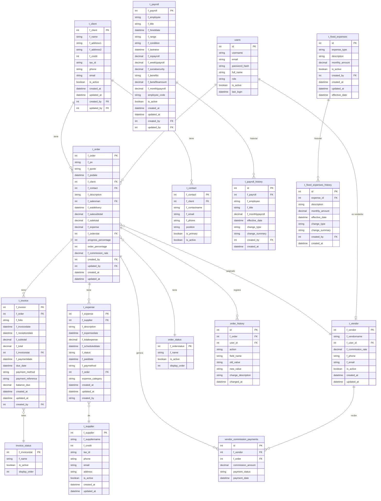
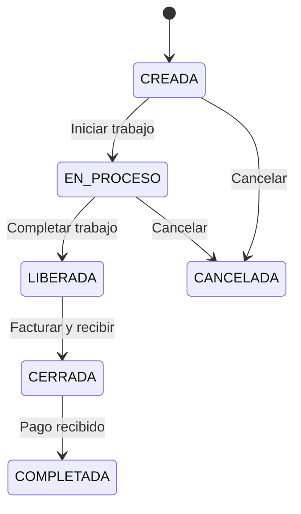

# Modelos y Esquema de Base de Datos

## Diagrama Entidad-Relacion (ERD)



## Tablas Principales

### 1. users - Usuarios del Sistema

| Columna | Tipo | Descripcion |
|---------|------|-------------|
| id | int (PK) | Identificador unico |
| username | string | Nombre de usuario (login) |
| email | string | Correo electronico |
| password_hash | string | Hash BCrypt de la contrasena |
| full_name | string | Nombre completo |
| role | string | Rol del usuario (admin/coordinator/salesperson) |
| is_active | boolean | Estado activo/inactivo |
| last_login | datetime | Ultimo inicio de sesion |

**Roles disponibles:**
- `admin` - Administrador con acceso total
- `coordinator` - Coordinador con acceso limitado a ordenes
- `salesperson` - Vendedor con acceso solo a sus comisiones

### 2. t_order - Ordenes/Proyectos

| Columna | Tipo | Descripcion |
|---------|------|-------------|
| f_order | int (PK) | ID de la orden |
| f_po | string | Numero de Purchase Order |
| f_quote | string | Numero de cotizacion |
| f_podate | datetime | Fecha de la orden |
| f_client | int (FK) | Cliente asociado |
| f_contact | int (FK) | Contacto del cliente |
| f_description | string | Descripcion del proyecto |
| f_salesman | int (FK) | Vendedor asignado |
| f_estdelivery | datetime | Fecha estimada de entrega |
| f_salesubtotal | decimal | Subtotal de venta |
| f_saletotal | decimal | Total de venta |
| f_expense | decimal | Gastos asociados |
| f_orderstat | int (FK) | Estado de la orden |
| progress_percentage | int | Porcentaje de progreso (0-100) |
| order_percentage | int | Porcentaje de ordenacion |
| f_commission_rate | decimal | Tasa de comision |

### 3. order_status - Estados de Ordenes

| ID | Nombre | Descripcion |
|----|--------|-------------|
| 0 | CREADA | Orden recien creada |
| 1 | EN PROCESO | Orden en trabajo |
| 2 | LIBERADA | Orden lista para facturar |
| 3 | CERRADA | Facturada y recibida |
| 4 | COMPLETADA | Pagada completamente |
| 5 | CANCELADA | Orden cancelada |



### 4. t_invoice - Facturas

| Columna | Tipo | Descripcion |
|---------|------|-------------|
| f_invoice | int (PK) | ID de factura |
| f_order | int (FK) | Orden asociada |
| f_folio | string | Numero de folio |
| f_invoicedate | datetime | Fecha de facturacion |
| f_receptiondate | datetime | Fecha de recepcion |
| f_subtotal | decimal | Subtotal |
| f_total | decimal | Total |
| f_invoicestat | int (FK) | Estado de la factura |
| f_paymentdate | datetime | Fecha de pago |
| due_date | datetime | Fecha de vencimiento |
| payment_method | string | Metodo de pago |
| payment_reference | string | Referencia del pago |
| balance_due | decimal | Saldo pendiente |

### 5. invoice_status - Estados de Facturas

| ID | Nombre | Descripcion |
|----|--------|-------------|
| 1 | PENDIENTE | Factura pendiente |
| 2 | ENVIADA | Factura enviada al cliente |
| 3 | VENCIDA | Factura vencida |
| 4 | PAGADA | Factura pagada |

### 6. t_client - Clientes

| Columna | Tipo | Descripcion |
|---------|------|-------------|
| f_client | int (PK) | ID del cliente |
| f_name | string | Nombre del cliente |
| f_address1 | string | Direccion linea 1 |
| f_address2 | string | Direccion linea 2 |
| f_credit | int | Dias de credito |
| tax_id | string | RFC/Tax ID |
| phone | string | Telefono |
| email | string | Email |
| is_active | boolean | Estado activo |

### 7. t_expense - Gastos

| Columna | Tipo | Descripcion |
|---------|------|-------------|
| f_expense | int (PK) | ID del gasto |
| f_supplier | int (FK) | Proveedor |
| f_description | string | Descripcion |
| f_expensedate | datetime | Fecha del gasto |
| f_totalexpense | decimal | Monto total |
| f_scheduleddate | datetime | Fecha programada de pago |
| f_status | string | Estado (PENDIENTE/PAGADO) |
| f_paiddate | datetime | Fecha de pago |
| f_paymethod | string | Metodo de pago |
| f_order | int (FK) | Orden asociada (opcional) |
| expense_category | string | Categoria del gasto |

### 8. t_payroll - Nomina

| Columna | Tipo | Descripcion |
|---------|------|-------------|
| f_payroll | int (PK) | ID del empleado |
| f_employee | string | Nombre del empleado |
| f_title | string | Puesto |
| f_hireddate | datetime | Fecha de contratacion |
| f_range | string | Rango/Nivel |
| f_condition | string | Condicion laboral |
| f_lastraise | datetime | Ultimo aumento |
| f_sspayroll | decimal | Salario SS |
| f_weeklypayroll | decimal | Salario semanal |
| f_socialsecurity | decimal | Seguro social |
| f_benefits | string | Beneficios |
| f_benefitsamount | decimal | Monto beneficios |
| f_monthlypayroll | decimal | Salario mensual |
| employee_code | string | Codigo empleado |
| is_active | boolean | Estado activo |

### 9. t_vendor - Vendedores

| Columna | Tipo | Descripcion |
|---------|------|-------------|
| f_vendor | int (PK) | ID del vendedor |
| f_vendorname | string | Nombre del vendedor |
| f_user_id | int (FK) | Usuario asociado |
| f_commission_rate | decimal | Tasa de comision (%) |
| f_phone | string | Telefono |
| f_email | string | Email |
| is_active | boolean | Estado activo |

### 10. vendor_commission_payments - Pagos de Comisiones

| Columna | Tipo | Descripcion |
|---------|------|-------------|
| id | int (PK) | ID del pago |
| f_vendor | int (FK) | Vendedor |
| f_order | int (FK) | Orden asociada |
| commission_amount | decimal | Monto de comision |
| payment_status | string | Estado (draft/pending/paid) |
| payment_date | datetime | Fecha de pago |

## Mapeo ORM (Postgrest)

Los modelos utilizan atributos de Postgrest para el mapeo:

```csharp
[Table("t_order")]
public class OrderDb : BaseModel
{
    [PrimaryKey("f_order", shouldInsert: false)]
    public int Id { get; set; }

    [Column("f_po")]
    public string Po { get; set; }

    [Column("f_client")]
    public int? ClientId { get; set; }

    // ... otros campos
}
```

## ViewModels

### OrderViewModel
Modelo de vista para mostrar ordenes en el DataGrid:

```csharp
public class OrderViewModel
{
    public int Id { get; set; }
    public string OrderNumber { get; set; }     // f_po
    public DateTime OrderDate { get; set; }      // f_podate
    public string ClientName { get; set; }       // Lookup desde t_client
    public string VendorName { get; set; }       // Lookup desde t_vendor
    public string Description { get; set; }      // f_description
    public decimal Subtotal { get; set; }        // f_salesubtotal
    public decimal Total { get; set; }           // f_saletotal
    public decimal InvoicedAmount { get; set; }  // Suma de facturas
    public int Progress { get; set; }            // progress_percentage
    public string Status { get; set; }           // Lookup desde order_status
}
```

## Auditoría y Historial

El sistema implementa auditoria en varias tablas:

### order_history
Registra cambios en ordenes:
- `action`: Tipo de accion (CREATE, UPDATE, STATUS_CHANGE, DELETE)
- `field_name`: Campo modificado
- `old_value`: Valor anterior
- `new_value`: Nuevo valor
- `change_description`: Descripcion del cambio

### t_payroll_history / t_fixed_expenses_history
Registra cambios historicos con fechas efectivas para calculos retroactivos de balance.
