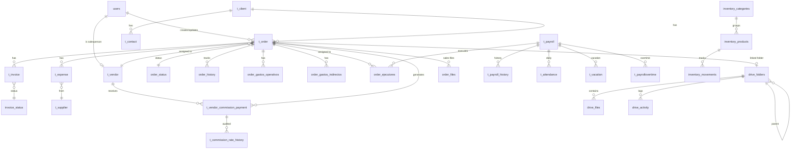

# Modelos de Datos (resumen semantico)

**Fuente canonica:** [../db-docs/output/](../db-docs/output/) (auto-generada desde Supabase en vivo).
**Regenerada:** 2026-04-20.

Este documento es una guia semantica — agrupa las 44 tablas por modulo, explica las relaciones clave y muestra el ERD de alto nivel. Para columnas exactas, tipos, indices, triggers y funciones ver los 7 archivos en `db-docs/output/`.

## Cifras actuales (BD en vivo, 2026-04-20)

| Objeto | Cantidad |
|---|---|
| Tablas | 44 |
| Vistas | 15 + 1 materializada |
| Funciones (RPCs + triggers) | 73 (33 RPC + 36 trigger + 4 huerfanas) |
| Triggers | 44 en 19 tablas |
| Indices | 147 (44 PK + 14 UNIQUE + 89 regular) |
| Foreign Keys | 68 |
| Tablas aisladas | 7 |
| RLS habilitado | 1 tabla (`order_ejecutores`) — ver [../db-docs/output/06_rls_policies.md](../db-docs/output/06_rls_policies.md) |

## Tablas por modulo

### Usuarios y sistema (4)
| Tabla | Proposito |
|---|---|
| `users` | Usuarios con role (direccion/administracion/proyectos/coordinacion/ventas). BCrypt en `password_hash`. |
| `app_versions` | Control de versiones para auto-update. Campo `is_latest` marca la version vigente. |
| `audit_log` | Log general de auditoria a nivel aplicacion. |
| `t_workday_config` | Configuracion de dias laborales (usado por calendario). |

### Ordenes / proyectos (7)
| Tabla | Proposito |
|---|---|
| `t_order` | Orden de compra / proyecto. Entidad central. FK a `t_client`, `t_contact`, `t_vendor`, `order_status`. |
| `order_status` | Catalogo de estados: CREADA(0), EN_PROCESO(1), LIBERADA(2), CERRADA(3), COMPLETADA(4), CANCELADA(5). |
| `order_history` | Trazabilidad de cambios por orden. |
| `order_gastos_operativos` | Gastos operativos con snapshot de `f_commission_rate` (incluye comision del vendedor). |
| `order_gastos_indirectos` | Gastos indirectos (sin comision). |
| `order_ejecutores` | **Fase 4**. Many-to-many entre ordenes y empleados de `t_payroll`. Unica tabla con RLS ON. |
| `order_files` | **Fase 4**. Archivos subidos a Supabase Storage desde Portal Ventas (facturas de vendedor). |
| `t_order_deleted` | Snapshot JSONB de ordenes eliminadas. |

### Clientes (2)
`t_client`, `t_contact` (1 cliente -> N contactos, uno marcado `is_primary`).

### Facturacion (3)
`t_invoice`, `invoice_status` (PENDIENTE, ENVIADA, VENCIDA, PAGADA), `invoice_audit`.

### Gastos / proveedores (3)
`t_expense`, `t_expense_audit`, `t_supplier`.

### Comisiones (3)
`t_vendor`, `t_vendor_commission_payment`, `t_commission_rate_history` — ver [FLUJO_COMISIONES.md](./FLUJO_COMISIONES.md) para el ciclo `draft -> pending -> paid`.

### Nomina (5)
`t_payroll`, `t_payroll_history`, `t_overtime_hours`, `t_overtime_hours_audit`, `t_payrollovertime` (legacy).

### Calendario / RRHH (6)
`t_attendance`, `t_attendance_audit`, `t_vacation`, `t_vacation_audit`, `t_holiday`, `t_workday_config`.

### Balance (3)
`t_fixed_expenses`, `t_fixed_expenses_history`, `t_balance_adjustments`.

### IMA Drive (4) — Fase 4
| Tabla | Proposito |
|---|---|
| `drive_folders` | Arbol de carpetas, auto-referencial (`parent_id`). Campo `linked_order_id` vincula una carpeta a `t_order`. |
| `drive_files` | Metadatos de archivos en R2. `r2_key` apunta al blob. Hash SHA256 para deteccion de conflictos. |
| `drive_activity` | Log de actividad a nivel aplicacion (creacion, subida, borrado). |
| `drive_audit` | Auditoria a nivel trigger (INSERT/UPDATE/DELETE automatico). |

### Inventario (4) — Fase 4
| Tabla | Proposito |
|---|---|
| `inventory_categories` | 8 categorias pre-configuradas (tornillos, cables, herramientas, etc). |
| `inventory_products` | Productos con stock, ubicacion, codigo, alertas de stock bajo. |
| `inventory_movements` | Movimientos de stock (entradas/salidas/ajustes). |
| `inventory_audit` | Auditoria de cambios. |

## Relaciones clave (ERD de alto nivel)


```mermaid
erDiagram
    users ||--o{ t_order : "creates/updates"
    users ||--o| t_vendor : "is salesperson"
    t_client ||--o{ t_order : "has"
    t_client ||--o{ t_contact : "has"
    t_order ||--o{ t_invoice : "has"
    t_order ||--o{ t_expense : "has"
    t_order }o--|| order_status : "status"
    t_order }o--|| t_vendor : "assigned to"
    t_order ||--o{ order_history : "tracks"
    t_order ||--o{ order_gastos_operativos : "has"
    t_order ||--o{ order_gastos_indirectos : "has"
    t_order ||--o{ order_ejecutores : "assigned to"
    t_payroll ||--o{ order_ejecutores : "executes"
    t_order ||--o| drive_folders : "linked folder"
    t_order ||--o{ order_files : "sales files"

    t_invoice }o--|| invoice_status : "status"
    t_expense }o--|| t_supplier : "from"

    t_vendor ||--o{ t_vendor_commission_payment : "receives"
    t_order ||--o{ t_vendor_commission_payment : "generates"
    t_vendor_commission_payment ||--o{ t_commission_rate_history : "audited"

    t_payroll ||--o{ t_payroll_history : "history"
    t_payroll ||--o{ t_attendance : "daily"
    t_payroll ||--o{ t_vacation : "vacation"
    t_payroll ||--o{ t_payrollovertime : "overtime"

    drive_folders ||--o{ drive_folders : "parent"
    drive_folders ||--o{ drive_files : "contains"
    drive_folders ||--o{ drive_activity : "logs"

    inventory_categories ||--o{ inventory_products : "groups"
    inventory_products ||--o{ inventory_movements : "tracks"
```

Para el ERD completo con todas las columnas ver [../db-docs/output/07_diagrama_er.md](../db-docs/output/07_diagrama_er.md).

## Vistas clave

| Vista | Uso |
|---|---|
| `v_order_gastos` | Ordenes con gastos calculados (material pagado/pendiente, operativo, indirecto). Critica para OrdersManagementWindow. |
| `v_balance_completo` | Balance mensual (ingresos + gastos + utilidad). Materializada por performance. |
| `v_balance_ingresos` | Ingresos esperados vs percibidos por mes. |
| `v_balance_gastos` | Desglose mensual: nomina, fijos, variables. |
| `v_income` | Detalle de ingresos por factura con fecha efectiva de pago. |
| `v_attendance_today` | Estado de asistencia del dia actual. |
| `v_attendance_monthly_summary` | Resumen mensual por empleado. |
| `v_attendance_stats` | Estadisticas del mes actual. |
| `v_attendance_history` | Historial de cambios de asistencia. |
| `v_vacations_active` | Vacaciones activas y proximas. |

Lista completa con definiciones SQL en [../db-docs/output/03_vistas.md](../db-docs/output/03_vistas.md).

## Funciones RPC relevantes

Total: 33 RPCs + 36 funciones trigger. Muestra seleccionada:

| Funcion | Uso |
|---|---|
| `get_folder_tree()` | Retorna arbol completo de carpetas de Drive (recursivo). |
| `get_folder_stats_bulk(parent_id)` | Stats de subcarpetas (file count, size) en una sola query. |
| `get_breadcrumb(folder_id)` | CTE recursivo para breadcrumb del Drive. |
| `get_recent_files(user_id, limit)` | Archivos recientes del usuario. |
| `scoped_search(folder_id, query)` | Busqueda dentro de un subarbol. |
| `validate_folder_move(folder_id, target_id)` | Valida que un move no cree ciclos. |
| `get_inventory_stats()` | Dashboard del modulo inventario. |
| `calculate_commission_amount(order_id, rate)` | Calcula comision con snapshot. |
| `update_order_status_from_invoices(order_id)` | Actualiza estado de orden segun facturas. |

Lista completa en [../db-docs/output/04_funciones_triggers.md](../db-docs/output/04_funciones_triggers.md).

## Campos de auditoria (estandar)

Todas las tablas de negocio incluyen:
- `created_at timestamp DEFAULT NOW()`
- `updated_at timestamp` (mantenido por trigger `update_*_updated_at`)
- `created_by int REFERENCES users(id)`
- `updated_by int REFERENCES users(id)`

## Roles en `users.role`

```sql
CHECK (role IN ('direccion', 'administracion', 'proyectos', 'coordinacion', 'ventas'))
```

Ver [04_ROLES_AUTENTICACION.md](./04_ROLES_AUTENTICACION.md) para la matriz de permisos.
