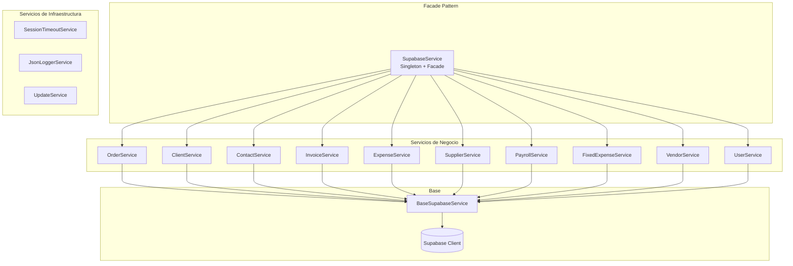
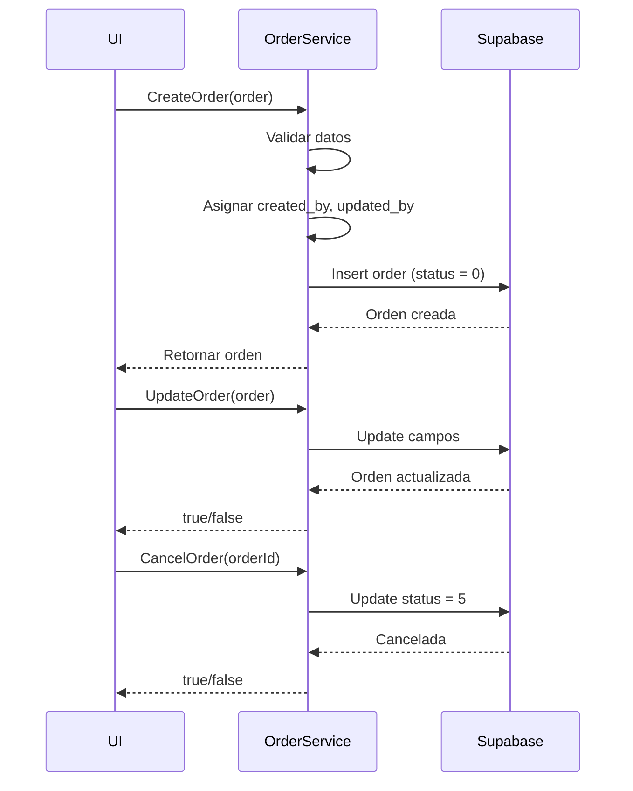
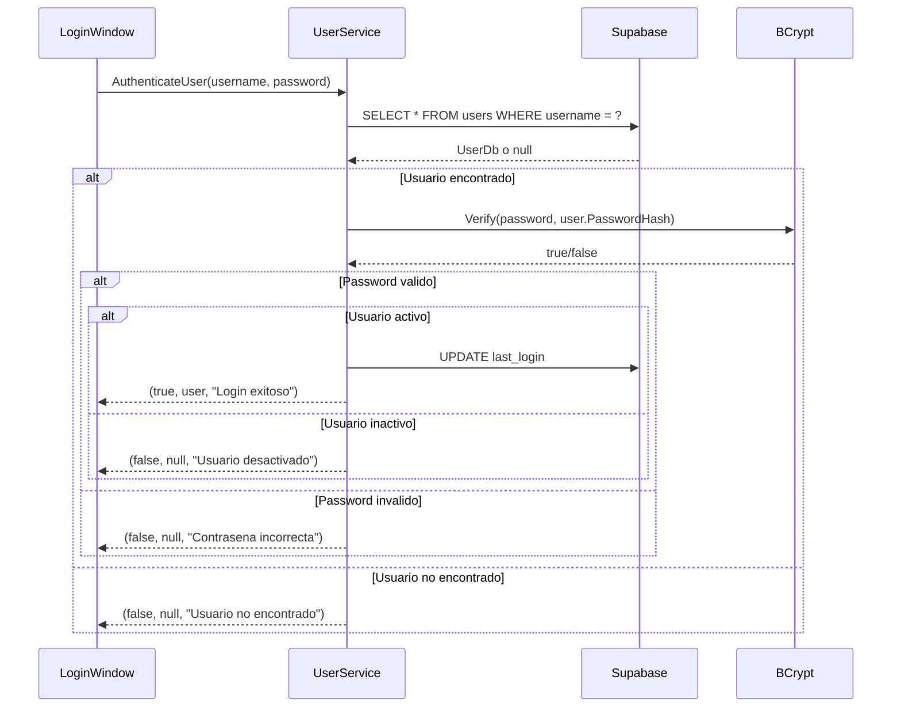
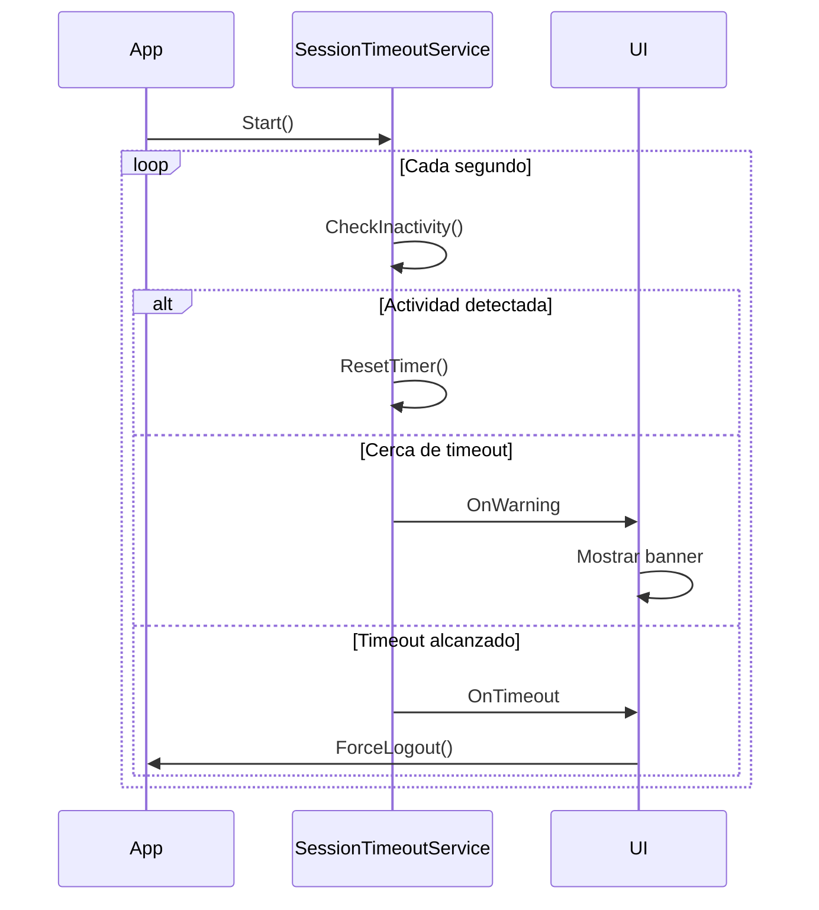
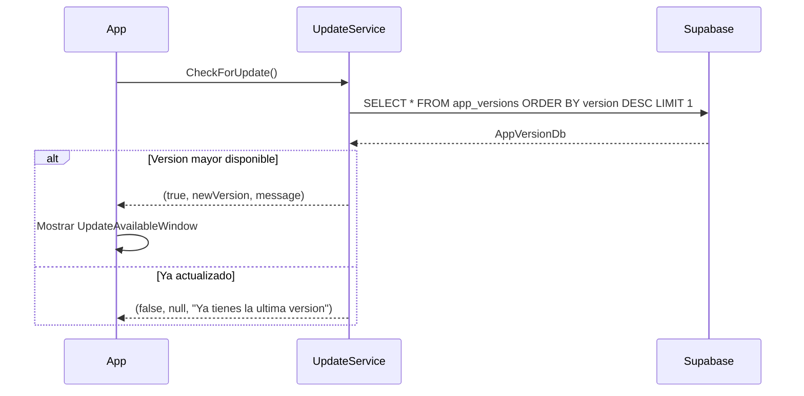

# Documentacion de Servicios

## Arquitectura de Servicios

El sistema implementa una arquitectura de servicios modular con un Facade central que orquesta todos los servicios especializados.



## 1. SupabaseService (Facade)

**Ubicacion:** `Services/SupabaseService.cs`

El servicio principal que actua como fachada para todos los servicios especializados. Implementa el patron Singleton.

### Responsabilidades:
- Inicializar y mantener la conexion con Supabase
- Delegar operaciones a servicios especializados
- Proporcionar una interfaz unificada para la capa de presentacion

### Inicializacion:
```csharp
public static SupabaseService Instance
{
    get
    {
        if (_instance == null)
        {
            lock (_lock)
            {
                if (_instance == null)
                {
                    _instance = new SupabaseService();
                }
            }
        }
        return _instance;
    }
}

private async Task InitializeAsync()
{
    // Cargar configuracion
    var url = _configuration["Supabase:Url"];
    var key = _configuration["Supabase:AnonKey"];

    // Inicializar cliente Supabase
    _supabaseClient = new Client(url, key, options);
    await _supabaseClient.InitializeAsync();

    // Inicializar servicios especializados
    _orderService = new OrderService(_supabaseClient);
    _clientService = new ClientService(_supabaseClient);
    // ... otros servicios
}
```

### Delegacion de Metodos:
```csharp
// Delegacion a OrderService
public Task<List<OrderDb>> GetOrders(int limit = 100, int offset = 0, List<int> filterStatuses = null)
    => _orderService.GetOrders(limit, offset, filterStatuses);

public Task<OrderDb> CreateOrder(OrderDb order, int userId = 0)
    => _orderService.CreateOrder(order, userId);
```

---

## 2. BaseSupabaseService

**Ubicacion:** `Services/Core/BaseSupabaseService.cs`

Clase base abstracta para todos los servicios que interactuan con Supabase.

```csharp
public abstract class BaseSupabaseService
{
    protected Client SupabaseClient { get; private set; }

    protected BaseSupabaseService(Client supabaseClient)
    {
        SupabaseClient = supabaseClient ?? throw new ArgumentNullException(nameof(supabaseClient));
    }

    protected void LogDebug(string message);
    protected void LogError(string message, Exception ex = null);
    protected void LogSuccess(string message);
}
```

---

## 3. OrderService

**Ubicacion:** `Services/Orders/OrderService.cs`

Gestiona todas las operaciones relacionadas con ordenes/proyectos.

### Metodos Principales:

| Metodo | Descripcion |
|--------|-------------|
| `GetOrders(limit, offset, filterStatuses)` | Obtiene ordenes con paginacion y filtros |
| `GetOrderById(orderId)` | Obtiene una orden por ID |
| `SearchOrders(searchTerm)` | Busca ordenes por termino |
| `CreateOrder(order, userId)` | Crea una nueva orden |
| `UpdateOrder(order, userId)` | Actualiza una orden existente |
| `DeleteOrderWithAudit(orderId, deletedBy, reason)` | Elimina orden con auditoria |
| `CancelOrder(orderId)` | Cancela una orden (status = 5) |
| `GetOrdersByClientId(clientId)` | Obtiene ordenes de un cliente |
| `GetRecentOrders(limit)` | Obtiene ordenes recientes |
| `CanCreateInvoice(orderId)` | Verifica si se puede facturar |

### Flujo de Estados:


---

## 4. UserService

**Ubicacion:** `Services/Users/UserService.cs`

Gestiona autenticacion y operaciones de usuarios.

### Metodos Principales:

| Metodo | Descripcion |
|--------|-------------|
| `AuthenticateUser(username, password)` | Autentica usuario con BCrypt |
| `GetUserByUsername(username)` | Obtiene usuario por nombre |
| `GetUserById(userId)` | Obtiene usuario por ID |
| `GetActiveUsers()` | Lista usuarios activos |
| `GetUsersByRole(role)` | Lista usuarios por rol |
| `CreateUser(user, plainPassword)` | Crea usuario con hash BCrypt |
| `UpdateUser(user)` | Actualiza datos de usuario |
| `ChangePassword(userId, newPassword)` | Cambia contrasena |
| `DeactivateUser(userId)` | Desactiva usuario (soft delete) |
| `ReactivateUser(userId)` | Reactiva usuario |

### Flujo de Autenticacion:


---

## 5. ClientService

**Ubicacion:** `Services/Clients/ClientService.cs`

Gestiona operaciones de clientes.

### Metodos:
- `GetClients()` - Lista todos los clientes
- `GetActiveClients()` - Lista clientes activos
- `GetClientById(clientId)` - Obtiene cliente por ID
- `GetClientByName(name)` - Busca cliente por nombre
- `CreateClient(client, userId)` - Crea nuevo cliente
- `UpdateClient(client, userId)` - Actualiza cliente
- `SoftDeleteClient(clientId)` - Desactiva cliente
- `ClientExists(name)` - Verifica si existe

---

## 6. InvoiceService

**Ubicacion:** `Services/Invoices/InvoiceService.cs`

Gestiona facturas y sus estados.

### Metodos:
- `GetInvoicesByOrder(orderId)` - Facturas de una orden
- `GetInvoicedTotalsByOrders(orderIds)` - Totales facturados por ordenes
- `CreateInvoice(invoice, userId)` - Crea factura
- `UpdateInvoice(invoice, userId)` - Actualiza factura
- `DeleteInvoice(invoiceId, userId)` - Elimina factura
- `GetInvoiceStatuses()` - Lista estados disponibles

---

## 7. ExpenseService

**Ubicacion:** `Services/Expenses/ExpenseService.cs`

Gestiona gastos y pagos a proveedores.

### Metodos:
- `GetExpenses(supplierId, status, fromDate, toDate, limit, offset)` - Lista gastos con filtros
- `GetExpenseById(expenseId)` - Obtiene gasto por ID
- `CreateExpense(expense)` - Crea nuevo gasto
- `UpdateExpense(expense)` - Actualiza gasto
- `MarkExpenseAsPaid(expenseId, paidDate, payMethod)` - Marca como pagado
- `DeleteExpense(expenseId)` - Elimina gasto
- `GetUpcomingExpenses(daysAhead)` - Gastos proximos
- `GetOverdueExpenses()` - Gastos vencidos
- `GetExpensesStatsByStatus()` - Estadisticas por estado

---

## 8. PayrollService

**Ubicacion:** `Services/Payroll/PayrollService.cs`

Gestiona nomina de empleados.

### Metodos:
- `GetActivePayroll()` - Lista empleados activos
- `GetPayrollHistory(payrollId, limit)` - Historial de cambios
- `GetPayrollById(id)` - Obtiene empleado por ID
- `CreatePayroll(payroll)` - Agrega empleado
- `UpdatePayroll(payroll)` - Actualiza datos
- `GetMonthlyPayrollTotal()` - Total mensual de nomina
- `DeactivateEmployee(employeeId, userId)` - Desactiva empleado

---

## 9. VendorService

**Ubicacion:** `Services/Vendors/VendorService.cs`

Gestiona vendedores y comisiones.

### Metodos:
- `GetVendors()` - Lista vendedores
- `GetVendorById(vendorId)` - Obtiene vendedor por ID

---

## 10. SessionTimeoutService

**Ubicacion:** `Services/SessionTimeoutService.cs`

Gestiona el timeout de sesion por inactividad. Implementa patron Singleton.

### Configuracion (appsettings.json):
```json
{
  "SessionTimeout": {
    "Enabled": true,
    "InactivityMinutes": 15,
    "WarningBeforeMinutes": 2
  }
}
```

### Eventos:
- `OnWarning` - Disparado cuando quedan 2 minutos
- `OnTimeout` - Disparado al alcanzar el timeout
- `OnTimerTick` - Cada segundo con segundos restantes

### Flujo:


---

## 11. JsonLoggerService

**Ubicacion:** `Services/JsonLoggerService.cs`

Gestiona el logging de la aplicacion en formato JSON.

### Metodos:
- `LogInfo(module, action, data)` - Log informativo
- `LogWarning(module, action, data)` - Log de advertencia
- `LogError(module, action, data)` - Log de error
- `LogLogin(username, success, userId, role)` - Log de login
- `LogDebug(module, action, data)` - Log de debug
- `CloseSessionAsync()` - Cierra sesion de log

### Estructura de archivos:
```
%LocalAppData%/SistemaGestionProyectos/logs/
└── sessions/
    └── session_2025-01-15_08-30-45/
        ├── session.json     # Logs de la sesion
        └── session_info.json # Metadata de la sesion
```

---

## 12. UpdateService

**Ubicacion:** `Services/Updates/UpdateService.cs`

Gestiona actualizaciones automaticas de la aplicacion.

### Metodos:
- `CheckForUpdate()` - Verifica si hay actualizacion disponible
- `DownloadUpdate(version)` - Descarga la actualizacion
- `InstallUpdate()` - Instala la actualizacion

### Flujo:


---

## Converters (Value Converters)

### RoleToVisibilityConverter
Convierte rol de usuario a visibilidad de elementos UI:

```csharp
public object Convert(object value, Type targetType, object parameter, CultureInfo culture)
{
    if (value is string role && parameter is string requiredRole)
    {
        return role == requiredRole ? Visibility.Visible : Visibility.Collapsed;
    }
    return Visibility.Collapsed;
}
```

### IsAdminToVisibilityConverter
Muestra elementos solo para administradores:

```csharp
public object Convert(object value, Type targetType, object parameter, CultureInfo culture)
{
    if (value is string role)
    {
        return role == "admin" ? Visibility.Visible : Visibility.Collapsed;
    }
    return Visibility.Collapsed;
}
```

---

## Mejores Practicas Implementadas

1. **Separacion de Responsabilidades**: Cada servicio maneja una entidad especifica
2. **Inyeccion de Dependencias**: Servicios reciben el cliente Supabase en constructor
3. **Logging Consistente**: BaseSupabaseService proporciona metodos de log uniformes
4. **Manejo de Errores**: Try-catch con logging en todos los metodos
5. **Async/Await**: Operaciones asincronas para no bloquear UI
