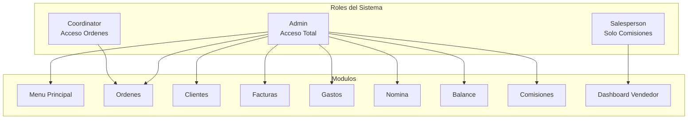
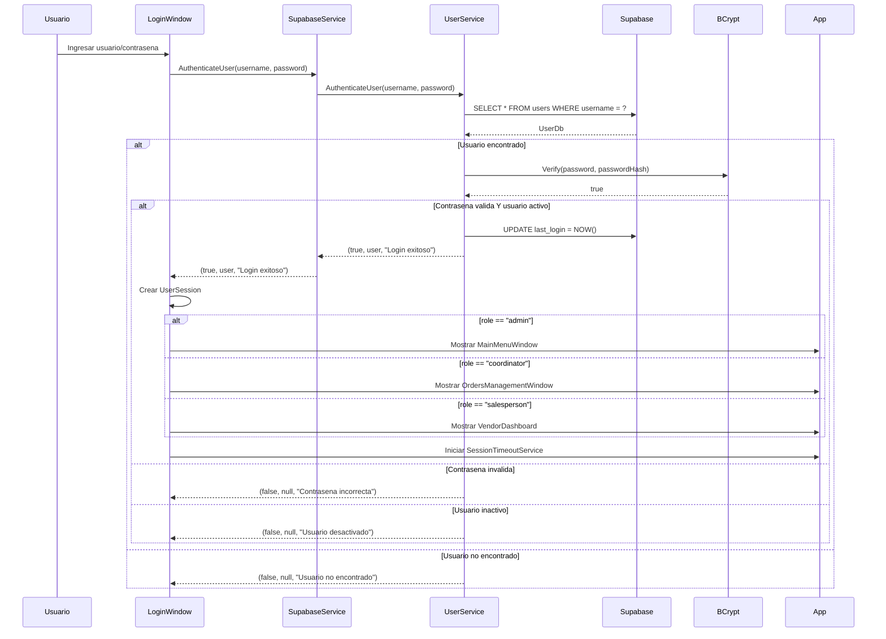
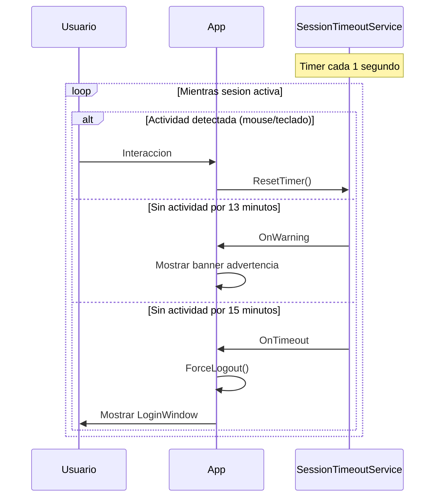

# Sistema de Roles y Autenticacion

## Vision General

El sistema implementa un esquema de **Control de Acceso Basado en Roles (RBAC)** con tres roles principales y permisos diferenciados por modulo.



## Definicion de Roles

### 1. Administrador (`admin`)

**Descripcion:** Acceso completo a todas las funcionalidades del sistema.

| Modulo | Permisos |
|--------|----------|
| Menu Principal | Acceso total |
| Ordenes | CRUD completo + estados financieros |
| Clientes | CRUD completo |
| Contactos | CRUD completo |
| Facturas | CRUD completo |
| Gastos | CRUD completo |
| Proveedores | CRUD completo |
| Nomina | Ver y editar |
| Balance | Ver y calcular |
| Comisiones | Gestionar y pagar |
| Ingresos Pendientes | Ver detalle |

**Pantalla inicial:** `MainMenuWindow`

### 2. Coordinador (`coordinator`)

**Descripcion:** Acceso limitado a la gestion de ordenes sin informacion financiera.

| Modulo | Permisos |
|--------|----------|
| Ordenes | Ver y editar (sin campos financieros) |
| Clientes | Solo lectura |
| Crear Ordenes | NO permitido |
| Ver Subtotales | NO permitido |
| Ver Totales | NO permitido |
| Ver Facturado | NO permitido |

**Pantalla inicial:** `OrdersManagementWindow` (directo, sin menu)

**Filtro de estados:** Solo ve ordenes con estados 0 (CREADA), 1 (EN PROCESO), 2 (LIBERADA)

### 3. Vendedor (`salesperson`)

**Descripcion:** Acceso exclusivo a su dashboard de comisiones.

| Modulo | Permisos |
|--------|----------|
| Dashboard Vendedor | Ver sus comisiones |
| Ordenes | NO permitido |
| Cualquier otro modulo | NO permitido |

**Pantalla inicial:** `VendorDashboard`

---

## Flujo de Autenticacion



---

## Modelo UserSession

Despues de la autenticacion exitosa, se crea un objeto `UserSession` que se pasa a todas las ventanas:

```csharp
public class UserSession
{
    public int Id { get; set; }          // ID del usuario
    public string Username { get; set; } // Nombre de usuario
    public string FullName { get; set; } // Nombre completo
    public string Role { get; set; }     // admin|coordinator|salesperson
    public DateTime LoginTime { get; set; } // Hora de login
}
```

---

## Implementacion de Permisos en UI

### En MainMenuWindow.xaml.cs

```csharp
private void ConfigurePermissions()
{
    switch (_currentUser.Role)
    {
        case "admin":
            // Admin tiene acceso a todo
            OrdersModuleButton.IsEnabled = true;
            VendorPortalButton.IsEnabled = true;
            break;
    }
}

// Verificacion al abrir modulos
private void OpenExpensePortal_Click(object sender, RoutedEventArgs e)
{
    if (_currentUser.Role != "admin")
    {
        MessageBox.Show(
            "No tiene permisos para acceder al Portal de Proveedores.",
            "Acceso Denegado",
            MessageBoxButton.OK,
            MessageBoxImage.Warning);
        return;
    }
    // Abrir ventana...
}
```

### En OrdersManagementWindow.xaml.cs

```csharp
private void ConfigurePermissions()
{
    switch (_currentUser.Role)
    {
        case "admin":
            NewOrderButton.IsEnabled = true;
            SubtotalColumn.Visibility = Visibility.Visible;
            TotalColumn.Visibility = Visibility.Visible;
            InvoicedColumn.Visibility = Visibility.Visible;
            break;

        case "coordinator":
            // Coordinador NO puede crear nuevas ordenes
            NewOrderButton.IsEnabled = false;
            NewOrderButton.Visibility = Visibility.Collapsed;

            // NO puede ver campos financieros
            SubtotalColumn.Visibility = Visibility.Collapsed;
            TotalColumn.Visibility = Visibility.Collapsed;
            InvoicedColumn.Visibility = Visibility.Collapsed;
            break;

        case "salesperson":
            // Los vendedores no deberian poder acceder aqui
            MessageBox.Show("No tiene permisos para acceder a este modulo.");
            this.Close();
            break;
    }
}
```

### Filtro de Estados por Rol

```csharp
private async Task LoadOrders(bool forceReload = false)
{
    List<int> statusFilter = null;

    if (_currentUser.Role == "coordinator")
    {
        // Coordinador solo ve estados 0, 1 y 2
        statusFilter = new List<int> { 0, 1, 2 };
    }
    else if (_currentUser.Role == "admin")
    {
        // Admin ve todo
        statusFilter = null;
    }

    var orders = await _supabaseService.GetOrders(
        limit: 100,
        filterStatuses: statusFilter
    );
}
```

---

## Value Converters para XAML

### RoleToVisibilityConverter

Muestra/oculta elementos segun el rol:

```csharp
public class RoleToVisibilityConverter : IValueConverter
{
    public object Convert(object value, Type targetType, object parameter, CultureInfo culture)
    {
        if (value is string role && parameter is string requiredRole)
        {
            return role == requiredRole ? Visibility.Visible : Visibility.Collapsed;
        }
        return Visibility.Collapsed;
    }
}
```

**Uso en XAML:**
```xml
<Button Content="Admin Only"
        Visibility="{Binding CurrentUser.Role,
                     Converter={StaticResource RoleToVisibilityConverter},
                     ConverterParameter=admin}"/>
```

### IsAdminToVisibilityConverter

Shortcut para elementos solo de admin:

```csharp
public class IsAdminToVisibilityConverter : IValueConverter
{
    public object Convert(object value, Type targetType, object parameter, CultureInfo culture)
    {
        if (value is string role)
        {
            return role == "admin" ? Visibility.Visible : Visibility.Collapsed;
        }
        return Visibility.Collapsed;
    }
}
```

---

## Seguridad de Contrasenas

El sistema utiliza **BCrypt** para el hashing de contrasenas:

### Hash al crear usuario:
```csharp
public async Task<UserDb> CreateUser(UserDb user, string plainPassword)
{
    // Hash de la contrasena con BCrypt
    user.PasswordHash = BCrypt.Net.BCrypt.HashPassword(plainPassword);
    user.IsActive = true;
    // Insert...
}
```

### Verificacion al login:
```csharp
bool isPasswordValid = BCrypt.Net.BCrypt.Verify(password, response.PasswordHash);
```

### Cambio de contrasena:
```csharp
public async Task<bool> ChangePassword(int userId, string newPassword)
{
    string hashedPassword = BCrypt.Net.BCrypt.HashPassword(newPassword);
    // Update...
}
```

---

## Timeout de Sesion

El sistema implementa cierre automatico por inactividad:



### Configuracion en appsettings.json:
```json
{
  "SessionTimeout": {
    "Enabled": true,
    "InactivityMinutes": 15,
    "WarningBeforeMinutes": 2
  }
}
```

---

## Matriz de Permisos Completa

| Funcionalidad | Admin | Coordinator | Salesperson |
|---------------|:-----:|:-----------:|:-----------:|
| Ver Menu Principal | Si | No | No |
| Ver Ordenes | Si | Si (filtrado) | No |
| Crear Ordenes | Si | No | No |
| Editar Ordenes | Si | Si | No |
| Cancelar Ordenes | Si | No | No |
| Ver Subtotales | Si | No | No |
| Ver Totales | Si | No | No |
| Ver Facturado | Si | No | No |
| Gestionar Facturas | Si | No | No |
| Gestionar Clientes | Si | No | No |
| Gestionar Contactos | Si | No | No |
| Gestionar Gastos | Si | No | No |
| Gestionar Proveedores | Si | No | No |
| Gestionar Nomina | Si | No | No |
| Ver Balance | Si | No | No |
| Gestionar Comisiones | Si | No | No |
| Ver sus Comisiones | Si | No | Si |
| Ingresos Pendientes | Si | No | No |

---

## Logging de Seguridad

Todas las acciones de autenticacion se registran:

```csharp
// Login exitoso
logger.LogLogin(username, true, user.Id.ToString(), user.Role);

// Login fallido
logger.LogLogin(username, false, null, null);

// Rol desconocido
logger.LogWarning("AUTH", "LOGIN_UNKNOWN_ROLE", new { username, role = user.Role });

// Logout forzado
_logger.LogWarning("SESSION", "FORCED_LOGOUT", new { reason, timestamp = DateTime.Now });
```
