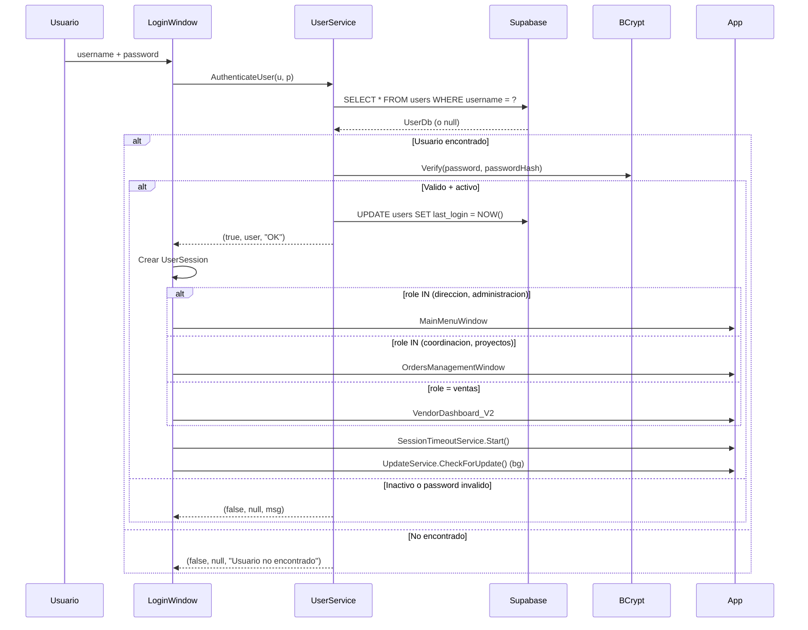

# Roles y Autenticacion

**Version:** 2.3.3 (abril 2026)

El sistema implementa RBAC con **5 roles** y permisos diferenciados por modulo. Auth local via BCrypt contra `users.password_hash`. Timeout por inactividad de 30 minutos con banner de advertencia a los 25.

## 5 roles del sistema

Constraint en BD:
```sql
CHECK (role IN ('direccion', 'administracion', 'proyectos', 'coordinacion', 'ventas'))
```

| Codigo | Nombre mostrado | Pantalla inicial |
|---|---|---|
| `direccion` | Direccion | `MainMenuWindow` |
| `administracion` | Administracion | `MainMenuWindow` |
| `proyectos` | Proyectos | `OrdersManagementWindow` (directo) |
| `coordinacion` | Coordinacion | `OrdersManagementWindow` (directo) |
| `ventas` | Ventas | `VendorDashboard_V2` |

**Nota legacy**: el codigo conserva un mapeo de los roles antiguos (`admin`, `coordinator`, `salesperson`) en `GetRoleDisplayName` para compatibilidad en mensajes, pero las filas en `users.role` ya no usan esos valores.

## Matriz de permisos

| Modulo | Direccion | Administracion | Coordinacion | Proyectos | Ventas |
|---|:---:|:---:|:---:|:---:|:---:|
| Menu Principal | Si | Si | No* | No* | No* |
| Ordenes (ver) | Si | Si | Si (filtrado) | Si (filtrado) | No |
| Ordenes: crear | Si | Si | No | No | No |
| Ordenes: editar | Si | Si | Si | Si | No |
| Ordenes: cancelar / eliminar | Si | Si | No | No | No |
| Ver subtotales / totales / facturado | Si | Si | No | No | No |
| Ver gastos (material/operativo/indirecto) | Si | No | No | No | No |
| Balance anual | Si | Si | No | No | No |
| Portal Proveedores | Si | Si | No | No | No |
| Ingresos Pendientes | Si | Si | No | No | No |
| Nomina y Gastos Fijos | Si | Si | No | No | No |
| Gestion de Clientes | Si | Si | No | No | No |
| Gestion de Vendedores / Comisiones | Si | Si | No | No | No |
| Gestion de Usuarios | Si | No | No | No | No |
| IMA Drive | Si | Si | Si | Si | Si |
| Inventario | Si | Si | Si | Si | Si |
| Calendario de Personal | Si | Si | No | No | No |
| Portal Ventas (subir factura, ver sus comisiones) | Si | No | No | No | Si |

_*Proyectos/Coordinacion/Ventas no llegan al menu principal: se les abre directamente su pantalla._

Implementado por switches sobre `_currentUser.Role` en las ventanas (`MainMenuWindow.xaml.cs`, `OrdersManagementWindow.xaml.cs`, etc).

## Diferencia Direccion vs Administracion

Ambos ven casi todo, pero solo **Direccion** accede a:
- Columnas de **gasto material / operativo / indirecto** de las ordenes (chequeado en `OrdersManagementWindow`).
- **Gestion de Usuarios** (crear/desactivar usuarios).

`AdminVisibilityConverter` es el converter usado en XAML para mostrar elementos solo cuando `Role in ('direccion', 'administracion')`. Para Direccion-unicamente, se usa comparacion directa en code-behind.

## Filtro de estados por rol en Ordenes

- `direccion` / `administracion`: ven todos los estados (0-5).
- `coordinacion` / `proyectos`: solo estados 0 (CREADA), 1 (EN PROCESO), 2 (LIBERADA).
- `ventas`: no accede al modulo.

```csharp
private async Task LoadOrders(bool forceReload = false) {
    List<int> statusFilter = null;
    if (_currentUser.Role == "coordinacion" || _currentUser.Role == "proyectos") {
        statusFilter = new List<int> { 0, 1, 2 };
    }
    // direccion / administracion: null = sin filtro
    var orders = await _supabaseService.GetOrders(limit: 100, filterStatuses: statusFilter);
}
```

## Flujo de autenticacion


```mermaid
sequenceDiagram
    participant U as Usuario
    participant LW as LoginWindow
    participant US as UserService
    participant DB as Supabase
    participant BC as BCrypt
    participant APP as App

    U->>LW: username + password
    LW->>US: AuthenticateUser(u, p)
    US->>DB: SELECT * FROM users WHERE username = ?
    DB-->>US: UserDb (o null)

    alt Usuario encontrado
        US->>BC: Verify(password, passwordHash)
        alt Valido + activo
            US->>DB: UPDATE users SET last_login = NOW()
            US-->>LW: (true, user, "OK")
            LW->>LW: Crear UserSession
            alt role IN (direccion, administracion)
                LW->>APP: MainMenuWindow
            else role IN (coordinacion, proyectos)
                LW->>APP: OrdersManagementWindow
            else role = ventas
                LW->>APP: VendorDashboard_V2
            end
            LW->>APP: SessionTimeoutService.Start()
            LW->>APP: UpdateService.CheckForUpdate() (bg)
        else Inactivo o password invalido
            US-->>LW: (false, null, msg)
        end
    else No encontrado
        US-->>LW: (false, null, "Usuario no encontrado")
    end
```

## UserSession

```csharp
public class UserSession {
    public int Id { get; set; }
    public string Username { get; set; }
    public string FullName { get; set; }
    public string Role { get; set; } // direccion|administracion|proyectos|coordinacion|ventas
    public DateTime LoginTime { get; set; }
}
```

Se pasa por constructor a todas las ventanas que requieren conocer al usuario.

## Seguridad de contrasenas

BCrypt (`BCrypt.Net-Next` 4.0.3).

```csharp
// Al crear:
user.PasswordHash = BCrypt.Net.BCrypt.HashPassword(plainPassword);

// Al login:
bool ok = BCrypt.Net.BCrypt.Verify(password, user.PasswordHash);

// Cambio:
user.PasswordHash = BCrypt.Net.BCrypt.HashPassword(newPassword);
```

No hay politica server-side de complejidad ni rotacion forzada — se maneja por convenio con el cliente.

## Session timeout

Configuracion (`appsettings.json`):
```json
"SessionTimeout": { "InactivityMinutes": 30, "WarningBeforeMinutes": 5, "Enabled": true }
```

Flujo:
1. `SessionTimeoutService` corre un timer de 1 segundo.
2. Cualquier input (mouse/teclado) llama `ResetTimer()`.
3. A los 25 minutos sin actividad emite `OnWarning` — la UI muestra `SessionTimeoutWarningWindow` ("Sesion cerrara en 5 min").
4. A los 30 minutos emite `OnTimeout` — la app llama `ForceLogout()` y muestra `LoginWindow` con mensaje.

El usuario puede extender la sesion desde el banner o simplemente mover el mouse.

## Logging de seguridad

Via `JsonLoggerService`:
```csharp
// Login exitoso
logger.LogLogin(username, true, user.Id.ToString(), user.Role);
// Login fallido
logger.LogLogin(username, false, null, null);
// Rol inesperado (defensa)
logger.LogWarning("AUTH", "LOGIN_UNKNOWN_ROLE", new { username, role = user.Role });
// Logout forzado
logger.LogWarning("SESSION", "FORCED_LOGOUT", new { reason, timestamp = DateTime.Now });
```

Logs en `%LOCALAPPDATA%/SistemaGestionProyectos/logs/sessions/session_*/`.

## Value converters (XAML)

### RoleToVisibilityConverter
```xml
<Button Visibility="{Binding CurrentUser.Role,
                     Converter={StaticResource RoleToVisibilityConverter},
                     ConverterParameter=direccion}"/>
```

### AdminVisibilityConverter
Shortcut: devuelve `Visible` si `role IN ('direccion','administracion')`, `Collapsed` si no.

```xml
<Button Visibility="{Binding CurrentUser.Role,
                     Converter={StaticResource AdminVisibilityConverter}}"/>
```

## Nota sobre RLS y seguridad de BD

El AnonKey de Supabase va dentro del .exe distribuido al cliente. Solo **1 de 44 tablas** (`order_ejecutores`) tiene RLS habilitado, y sus 3 policies son permisivas a PUBLIC (`USING true`). En la practica, cualquier usuario legitimo con la app puede enviar queries REST arbitrarias a cualquier tabla via postgrest.

La autorizacion por rol descrita arriba vive **solo en la UI** — no hay enforcement a nivel BD. Para modelos de amenaza que incluyan al propio usuario como adversario se requiere RLS real. Ver [../db-docs/output/06_rls_policies.md](../db-docs/output/06_rls_policies.md) para el estado actual y tablas sensibles identificadas.
