# Flujos de Trabajo y Procesos

## 1. Ciclo de Vida de una Orden

### Diagrama de Estados

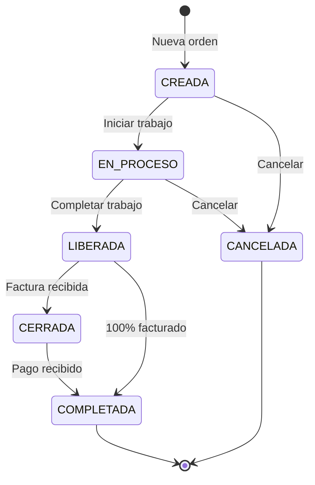

### Descripcion de Estados

| Estado | Codigo | Descripcion | Acciones Permitidas |
|--------|:------:|-------------|---------------------|
| CREADA | 0 | Orden recien creada | Editar, Cancelar, Pasar a EN_PROCESO |
| EN PROCESO | 1 | Trabajo en progreso | Editar, Actualizar progreso, Cancelar |
| LIBERADA | 2 | Trabajo completado, lista para facturar | Crear facturas |
| CERRADA | 3 | Facturada y recibida por cliente | Registrar pagos |
| COMPLETADA | 4 | Totalmente pagada | Solo lectura |
| CANCELADA | 5 | Orden cancelada | Solo lectura |

### Flujo Completo

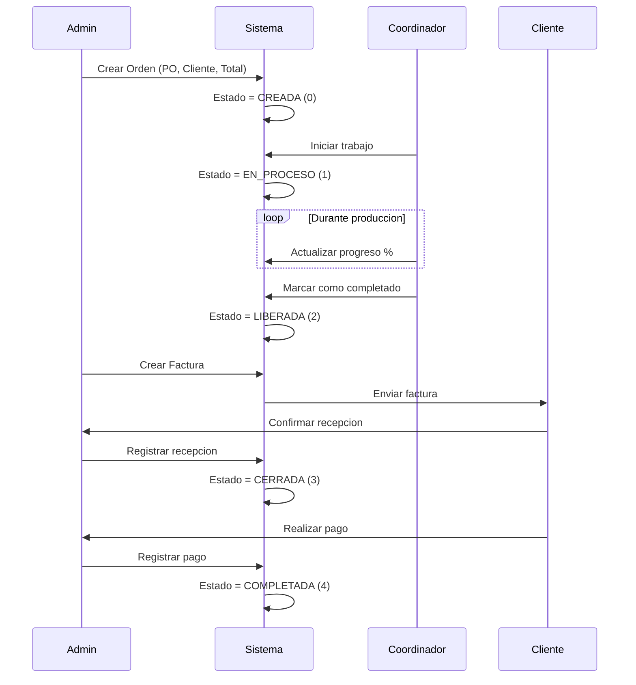

---

## 2. Proceso de Facturacion

### Flujo de Creacion de Factura

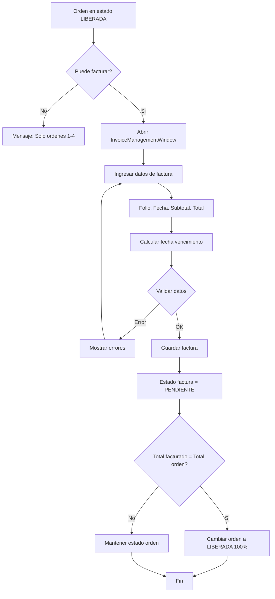

### Estados de Factura

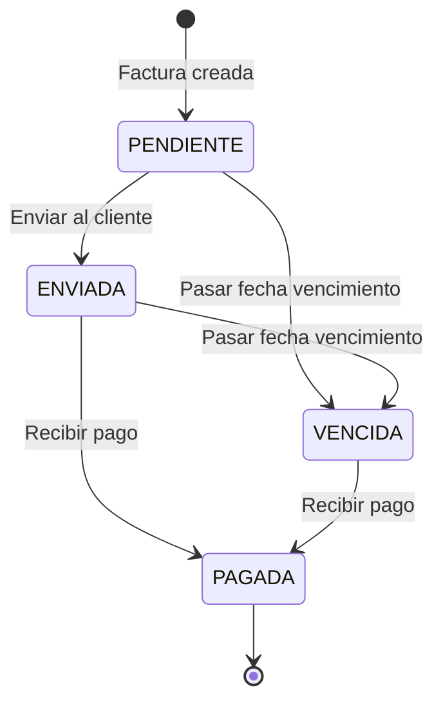

### Calculo de Fecha de Vencimiento

```csharp
// Se calcula automaticamente basado en los dias de credito del cliente
DueDate = InvoiceDate + ClientCreditDays
```

---

## 3. Gestion de Gastos

### Flujo de Gastos

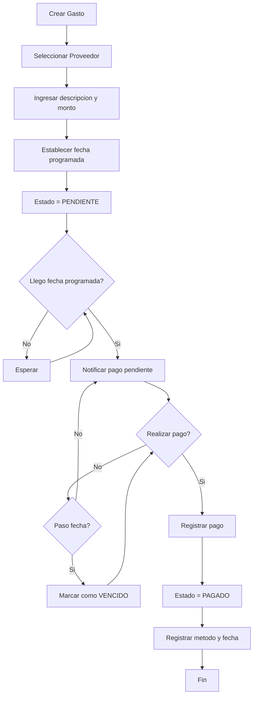

### Estados de Gastos

| Estado | Descripcion |
|--------|-------------|
| PENDIENTE | Gasto creado, pendiente de pago |
| PAGADO | Gasto pagado |
| VENCIDO | Paso la fecha programada sin pagar |

---

## 4. Proceso de Comisiones

### Calculo de Comisiones

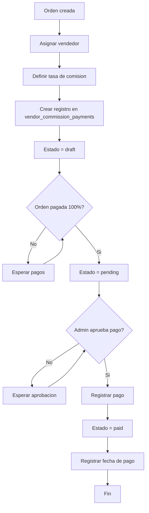

### Vista del Vendedor

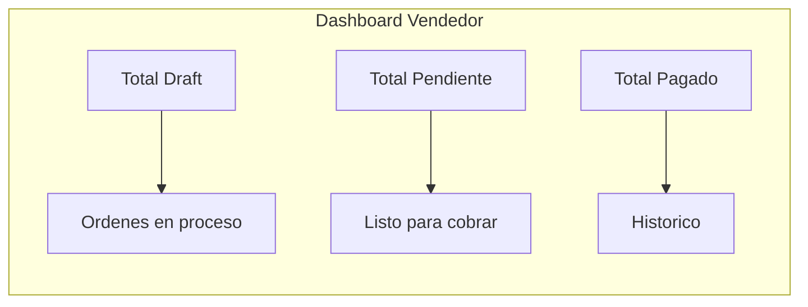

---

## 5. Flujo de Balance Mensual

### Calculo de Balance

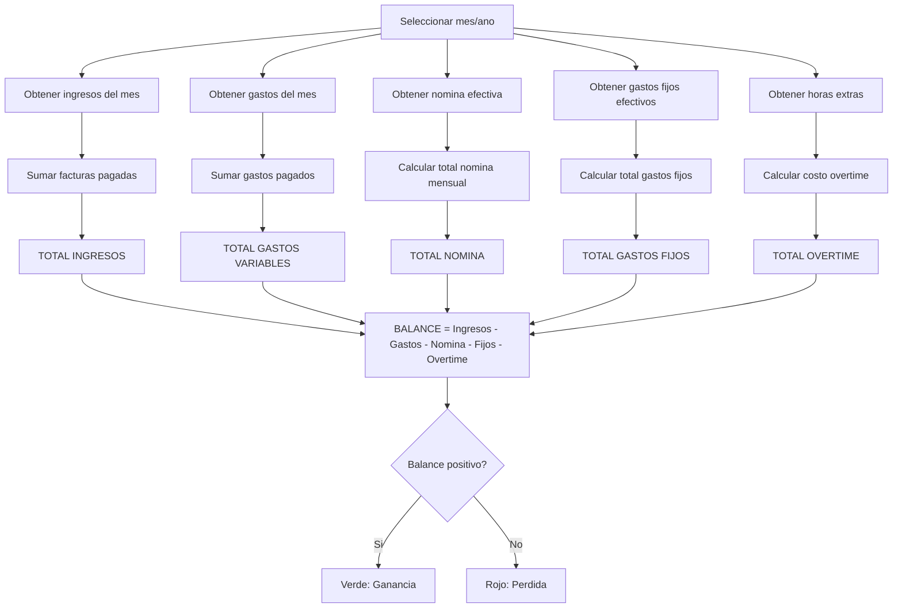

### Datos Efectivos por Fecha

El sistema usa fechas efectivas para calculos retroactivos:

```csharp
// Obtener nomina efectiva para una fecha especifica
public async Task<List<PayrollTable>> GetEffectivePayroll(DateTime effectiveDate)
{
    // Retorna la nomina vigente en esa fecha
}

// Obtener gastos fijos efectivos
public async Task<List<FixedExpenseTable>> GetEffectiveFixedExpenses(DateTime effectiveDate)
{
    // Retorna gastos fijos vigentes en esa fecha
}
```

---

## 6. Flujo de Actualizaciones

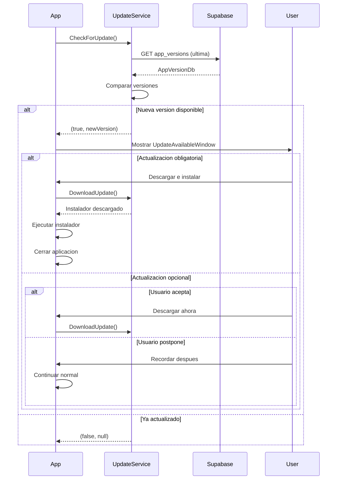

---

## 7. Gestion de Clientes

### Flujo CRUD de Clientes

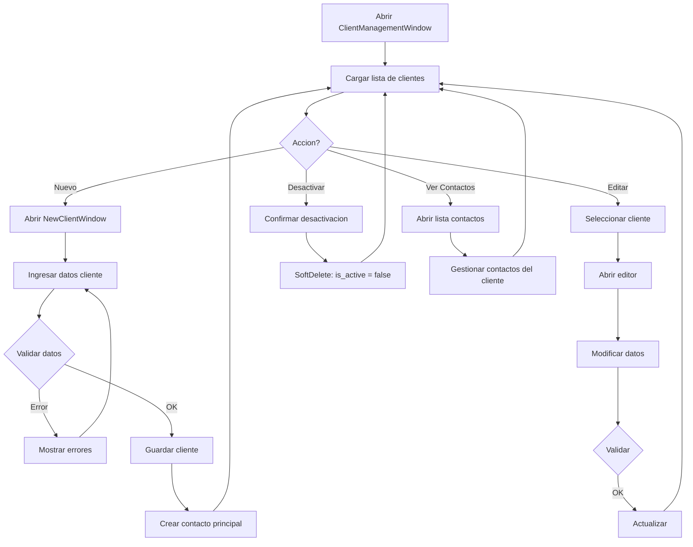

---

## 8. Timeout de Sesion

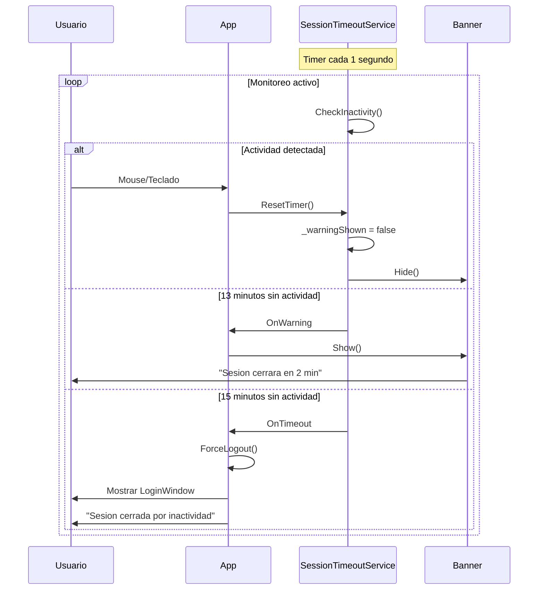

---

## 9. Ingresos Pendientes

### Flujo de Consulta

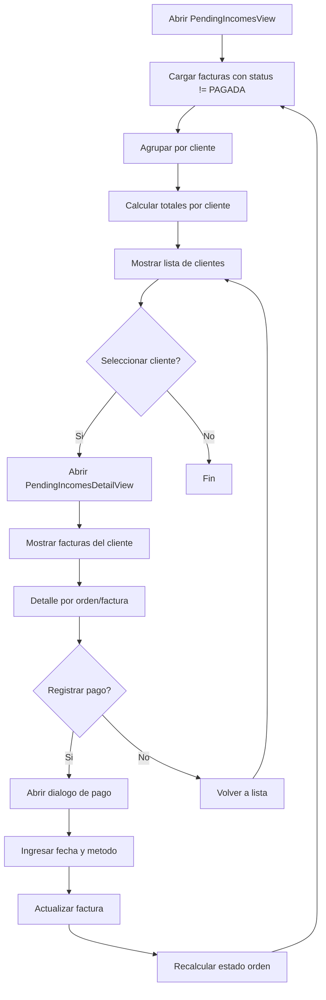

---

## Diagrama de Navegacion General

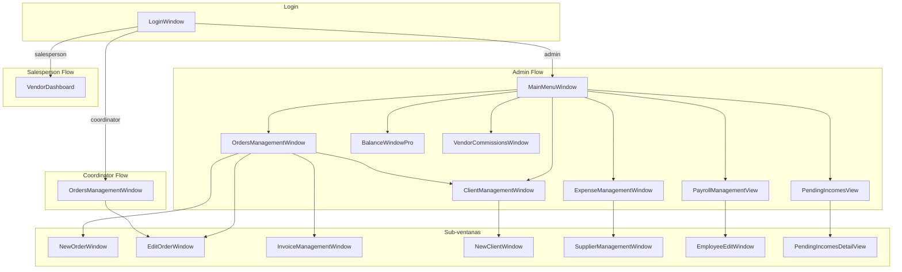
