# Flujos de Trabajo

**Version:** 2.3.3 (abril 2026)

## 1. Ciclo de vida de una orden

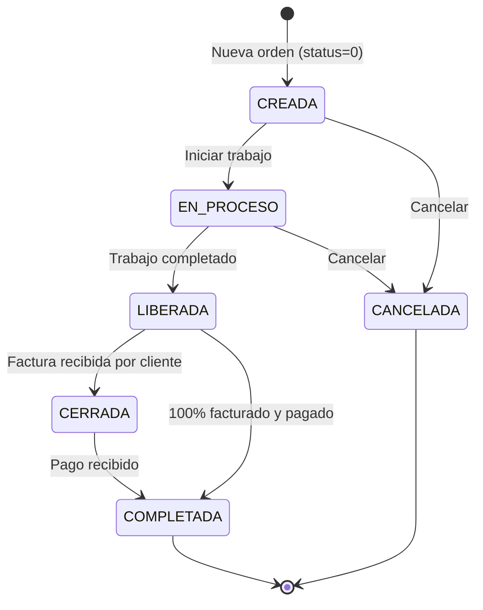
```mermaid
stateDiagram-v2
    [*] --> CREADA: Nueva orden (status=0)
    CREADA --> EN_PROCESO: Iniciar trabajo
    CREADA --> CANCELADA: Cancelar
    EN_PROCESO --> LIBERADA: Trabajo completado
    EN_PROCESO --> CANCELADA: Cancelar
    LIBERADA --> CERRADA: Factura recibida por cliente
    LIBERADA --> COMPLETADA: 100% facturado y pagado
    CERRADA --> COMPLETADA: Pago recibido
    COMPLETADA --> [*]
    CANCELADA --> [*]
```

| Estado | Codigo | Descripcion | Acciones |
|---|:---:|---|---|
| CREADA | 0 | Recien creada | Editar, cancelar, pasar a EN_PROCESO |
| EN_PROCESO | 1 | Trabajo en progreso | Editar, actualizar progreso, cancelar |
| LIBERADA | 2 | Lista para facturar | Crear facturas |
| CERRADA | 3 | Facturada y recibida | Registrar pagos |
| COMPLETADA | 4 | Totalmente pagada | Solo lectura |
| CANCELADA | 5 | Cancelada | Solo lectura |

Filtrado por rol: Coordinacion/Proyectos solo ven estados 0-2. Ver [04_ROLES_AUTENTICACION.md](./04_ROLES_AUTENTICACION.md#filtro-de-estados-por-rol-en-ordenes).

## 2. Asignacion de ejecutor (Fase 4)

Nueva columna en Ordenes: chips con iniciales de empleados de `t_payroll` asignados a la orden via `order_ejecutores`.

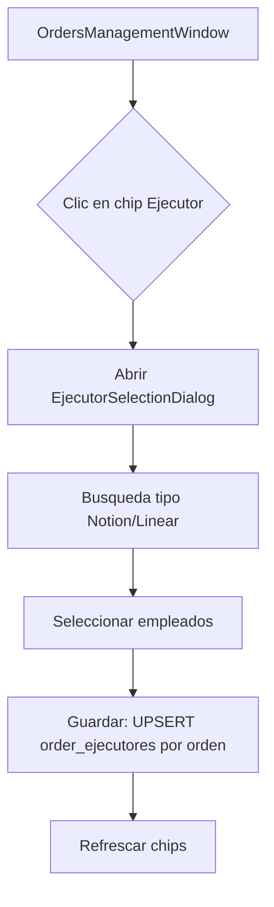
```mermaid
flowchart TD
    A[OrdersManagementWindow] --> B{Clic en chip Ejecutor}
    B --> C[Abrir EjecutorSelectionDialog]
    C --> D[Busqueda tipo Notion/Linear]
    D --> E[Seleccionar empleados]
    E --> F[Guardar: UPSERT order_ejecutores por orden]
    F --> G[Refrescar chips]
```

RLS en `order_ejecutores` existe pero es permisivo (`USING true`) — en la practica la autorizacion es UI-only.

## 3. Facturacion

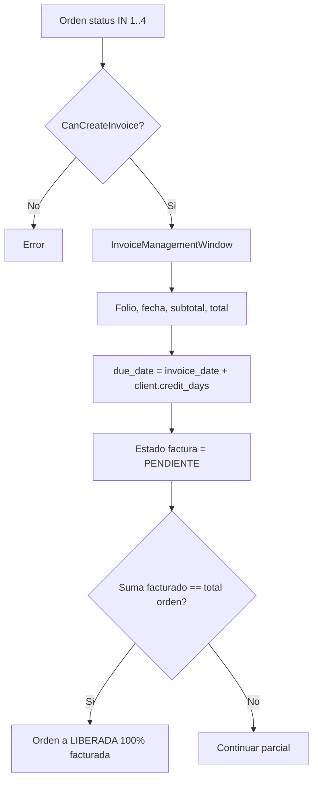
```mermaid
flowchart TD
    A[Orden status IN 1..4] --> B{CanCreateInvoice?}
    B -->|No| C[Error]
    B -->|Si| D[InvoiceManagementWindow]
    D --> E[Folio, fecha, subtotal, total]
    E --> F[due_date = invoice_date + client.credit_days]
    F --> G[Estado factura = PENDIENTE]
    G --> H{Suma facturado == total orden?}
    H -->|Si| I[Orden a LIBERADA 100% facturada]
    H -->|No| J[Continuar parcial]
```

Estados de factura: PENDIENTE(1) -> ENVIADA(2) -> PAGADA(4). O PENDIENTE/ENVIADA -> VENCIDA(3) al pasar `due_date`.

## 4. Gastos a proveedores

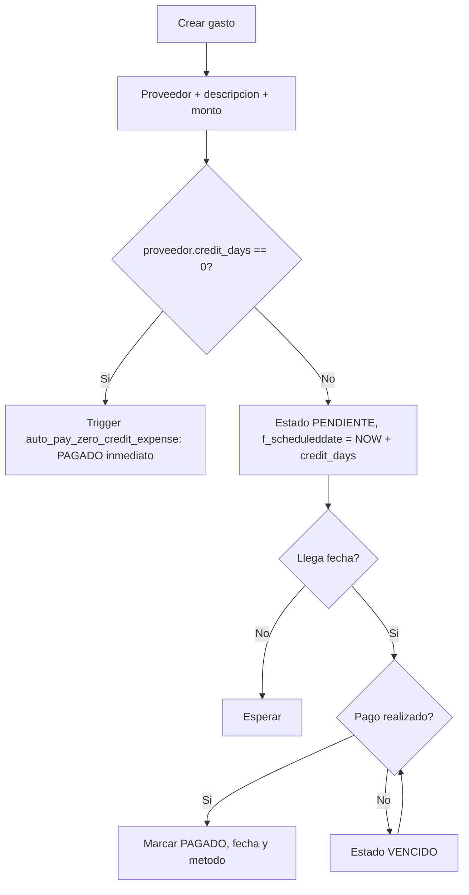
```mermaid
flowchart TD
    A[Crear gasto] --> B[Proveedor + descripcion + monto]
    B --> C{proveedor.credit_days == 0?}
    C -->|Si| D[Trigger auto_pay_zero_credit_expense: PAGADO inmediato]
    C -->|No| E[Estado PENDIENTE, f_scheduleddate = NOW + credit_days]
    E --> F{Llega fecha?}
    F -->|No| G[Esperar]
    F -->|Si| H{Pago realizado?}
    H -->|Si| I[Marcar PAGADO, fecha y metodo]
    H -->|No| J[Estado VENCIDO]
    J --> H
```

Eliminacion de gastos requiere UPDATE previo de `updated_by` (para capturar quien elimina en el trigger de auditoria), despues DELETE.

## 5. Comisiones de vendedores

Resumen (detalle completo en [FLUJO_COMISIONES.md](./FLUJO_COMISIONES.md)):

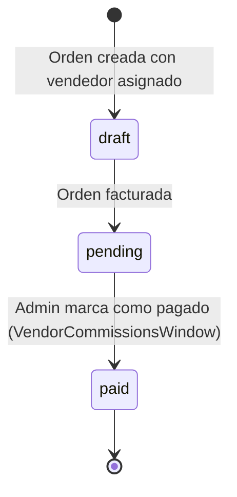
```mermaid
stateDiagram-v2
    [*] --> draft: Orden creada con vendedor asignado
    draft --> pending: Orden facturada
    pending --> paid: Admin marca como pagado (VendorCommissionsWindow)
    paid --> [*]
```

Portal Ventas V2 (Fase 4) agrego el flujo de **liberar orden**: el vendedor sube factura -> admin revisa -> admin aprueba -> comision pasa a `pending`. Ver [FLUJO_COMISIONES.md](./FLUJO_COMISIONES.md#portal-ventas-v2).

## 6. Balance mensual

Calculo mes a mes agregando:
- Ingresos: facturas PAGADAS del mes.
- Gastos variables: `t_expense` PAGADOS del mes.
- Nomina: `t_payroll` efectiva al mes (`effective_date`).
- Gastos fijos: `t_fixed_expenses` efectivos al mes.
- Overtime: `t_overtime_hours.amount` del mes.
- Ajustes manuales: `t_balance_adjustments` del mes.

Persistido en vista materializada `v_balance_completo` por performance. Refresh manual o automatico tras cambios significativos.

## 7. IMA Drive — Upload/Download (Fase 4)

### Upload simple
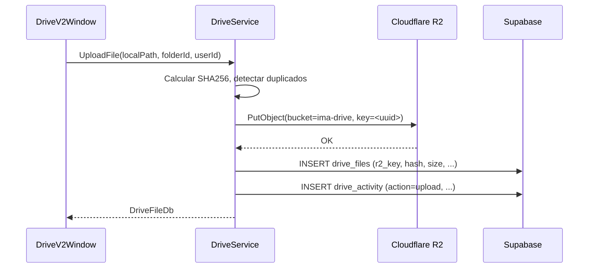
```mermaid
sequenceDiagram
    participant UI as DriveV2Window
    participant DS as DriveService
    participant R2 as Cloudflare R2
    participant DB as Supabase

    UI->>DS: UploadFile(localPath, folderId, userId)
    DS->>DS: Calcular SHA256, detectar duplicados
    DS->>R2: PutObject(bucket=ima-drive, key=<uuid>)
    R2-->>DS: OK
    DS->>DB: INSERT drive_files (r2_key, hash, size, ...)
    DS->>DB: INSERT drive_activity (action=upload, ...)
    DS-->>UI: DriveFileDb
```

Upload multiple: hasta 5 en paralelo, con ghost cards de progreso en UI.

### Download de carpeta como ZIP
Construye el ZIP en memoria streaming (no carga todo a RAM). `CollectAllFilesRecursive` arma el arbol; cada archivo se descarga via `DownloadFileToStream` y se escribe en la entrada ZIP.

## 8. IMA Drive — Open-in-Place (Fase 4)

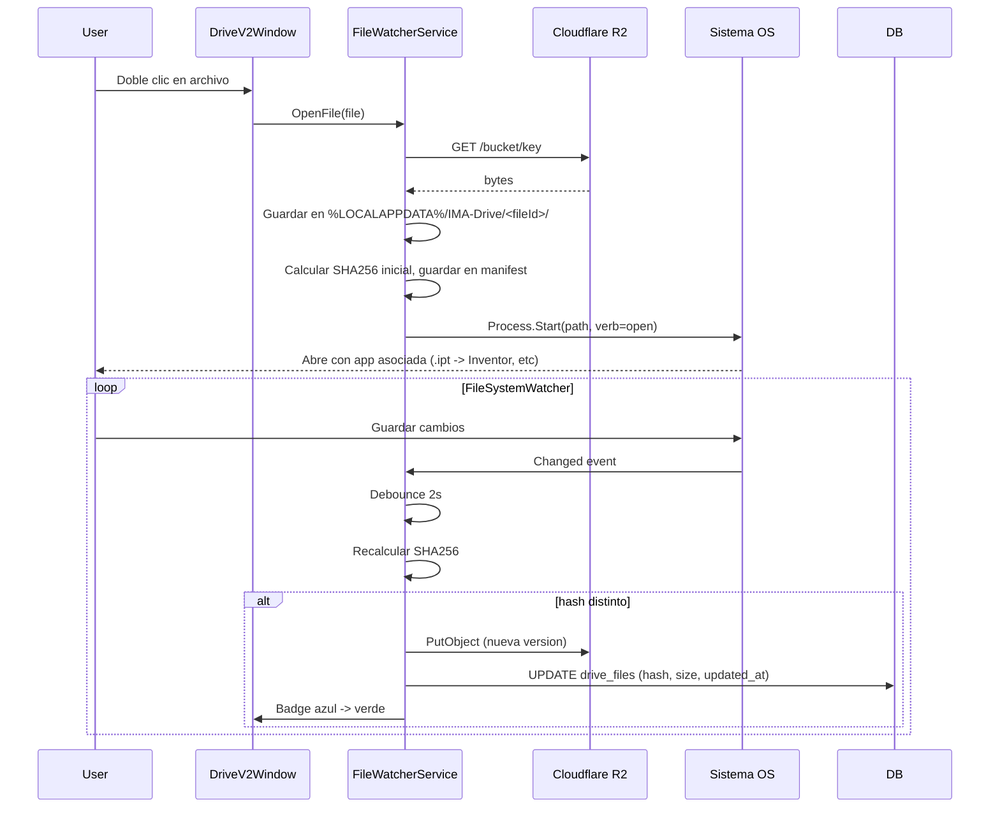
```mermaid
sequenceDiagram
    participant User
    participant UI as DriveV2Window
    participant FW as FileWatcherService
    participant R2 as Cloudflare R2
    participant OS as Sistema OS

    User->>UI: Doble clic en archivo
    UI->>FW: OpenFile(file)
    FW->>R2: GET /bucket/key
    R2-->>FW: bytes
    FW->>FW: Guardar en %LOCALAPPDATA%/IMA-Drive/<fileId>/
    FW->>FW: Calcular SHA256 inicial, guardar en manifest
    FW->>OS: Process.Start(path, verb=open)
    OS-->>User: Abre con app asociada (.ipt -> Inventor, etc)

    loop FileSystemWatcher
        User->>OS: Guardar cambios
        OS->>FW: Changed event
        FW->>FW: Debounce 2s
        FW->>FW: Recalcular SHA256
        alt hash distinto
            FW->>R2: PutObject (nueva version)
            FW->>DB: UPDATE drive_files (hash, size, updated_at)
            FW->>UI: Badge azul -> verde
        end
    end
```

Deteccion de conflicto: si el `remote_hash` cambio entre la descarga y el upload, se muestra dialogo de resolucion manual.

Deteccion de **Save As** en apps CAD: si Inventor/SolidWorks guarda como nuevo archivo en subdirectorio, el watcher lo detecta y ofrece subirlo al Drive.

## 9. IMA Drive — Vincular carpeta a orden (Fase 4)

Desde `OrdersManagementWindow`, columna CARPETA:
1. Clic en icono de carpeta -> abre `DriveV2Window` en modo seleccion.
2. Usuario elige carpeta existente o crea una nueva.
3. `DriveService.LinkFolderToOrder(folderId, orderId)` actualiza `drive_folders.linked_order_id`.
4. En `OrdersManagementWindow`, `GetLinkedFolderIds(orderIds)` bulk refresca los iconos.

Restriccion: una carpeta solo puede estar vinculada a UNA orden. `ValidateFolderLink` lo verifica antes del UPDATE.

## 10. Inventario — Ajustar stock (Fase 4)

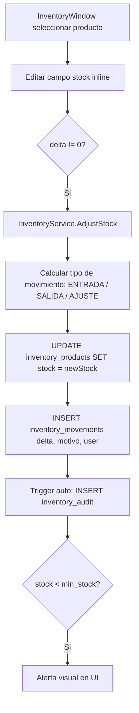
```mermaid
flowchart TD
    A[InventoryWindow seleccionar producto] --> B[Editar campo stock inline]
    B --> C{delta != 0?}
    C -->|Si| D[InventoryService.AdjustStock]
    D --> E[Calcular tipo de movimiento: ENTRADA / SALIDA / AJUSTE]
    E --> F[UPDATE inventory_products SET stock = newStock]
    F --> G[INSERT inventory_movements delta, motivo, user]
    G --> H[Trigger auto: INSERT inventory_audit]
    H --> I{stock < min_stock?}
    I -->|Si| J[Alerta visual en UI]
```

## 11. Portal Ventas V2 (Fase 4) — Liberar orden

Desde `VendorDashboard_V2`:
1. Vendedor ve orden en estado LIBERADA -> boton "Liberar pago".
2. Stepper visual 3 pasos: **LIBERADA -> REVISION -> PAGO**.
3. Vendedor sube factura (PDF/imagen) -> `StorageService.UploadFile` a bucket `order-files`, registra en `order_files`.
4. Estado de comision pasa a `draft` -> admin ve en `VendorCommissionsWindow`.
5. Admin preview (zoom 50-500%, pan) -> aprueba -> comision pasa a `pending`.
6. Admin paga -> estado `paid`, `payment_date = NOW()`.

## 12. Auto-update (con fix UIPI/schtasks, abril 2026)

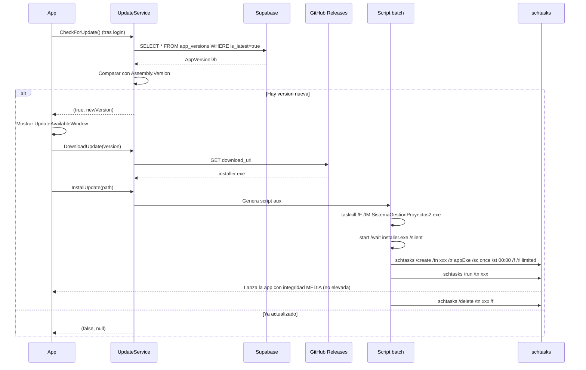
```mermaid
sequenceDiagram
    participant App
    participant US as UpdateService
    participant DB as Supabase
    participant GH as GitHub Releases
    participant BAT as Script batch
    participant Task as schtasks

    App->>US: CheckForUpdate() (tras login)
    US->>DB: SELECT * FROM app_versions WHERE is_latest=true
    DB-->>US: AppVersionDb
    US->>US: Comparar con Assembly.Version
    alt Hay version nueva
        US-->>App: (true, newVersion)
        App->>App: Mostrar UpdateAvailableWindow
        App->>US: DownloadUpdate(version)
        US->>GH: GET download_url
        GH-->>US: installer.exe
        App->>US: InstallUpdate(path)
        US->>BAT: Genera script aux
        BAT->>BAT: taskkill /F /IM SistemaGestionProyectos2.exe
        BAT->>BAT: start /wait installer.exe /silent
        BAT->>Task: schtasks /create /tn xxx /tr appExe /sc once /st 00:00 /f /rl limited
        BAT->>Task: schtasks /run /tn xxx
        Task-->>App: Lanza la app con integridad MEDIA (no elevada)
        BAT->>Task: schtasks /delete /tn xxx /f
    else Ya actualizado
        US-->>App: (false, null)
    end
```

Por que `schtasks /rl limited`: despues de correr el installer.exe (elevado por UAC), el proceso padre tiene token elevado. `Process.Start` hereda ese token. Solo `schtasks` con `/rl limited` o Shell COM `IShellDispatch2.ShellExecute` pueden lanzar el hijo con integridad media. Sin esto, UIPI bloquea drag-drop desde Explorer hacia la app.

Historial de los 5 fixes (abril 2026): `4c93493`, `bcd58e6`, `3d38fff`, `0bdc11c`, `d44710d`. Ver [03_SERVICIOS.md](./03_SERVICIOS.md#updateservice-con-fixes-de-abril-2026).

## 13. Timeout de sesion

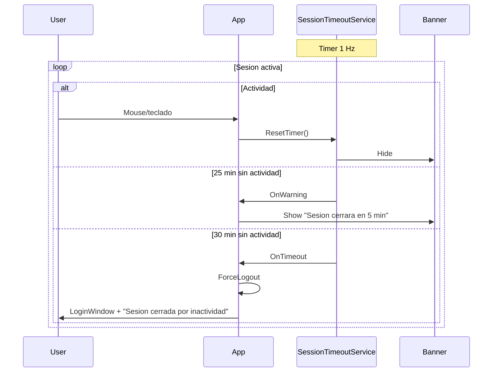
```mermaid
sequenceDiagram
    participant User
    participant App
    participant STS as SessionTimeoutService
    participant Banner

    Note over STS: Timer 1 Hz
    loop Sesion activa
        alt Actividad
            User->>App: Mouse/teclado
            App->>STS: ResetTimer()
            STS->>Banner: Hide
        else 25 min sin actividad
            STS->>App: OnWarning
            App->>Banner: Show "Sesion cerrara en 5 min"
        else 30 min sin actividad
            STS->>App: OnTimeout
            App->>App: ForceLogout
            App->>User: LoginWindow + "Sesion cerrada por inactividad"
        end
    end
```

## 14. Gestion de clientes

CRUD estandar (`ClientManagementWindow`) con soft-delete (`is_active = false`). Al crear cliente, se crea tambien un contacto principal (`is_primary = true`). Edicion de contactos desde panel lateral.

## 15. Ingresos pendientes

`PendingIncomesView` agrupa por cliente las facturas con `f_invoicestat != PAGADA`. Detalle por cliente en `PendingIncomesDetailView` con registro de pagos (fecha, metodo, monto). Al pagar una factura, se recalcula estado de la orden.

## 16. Navegacion general

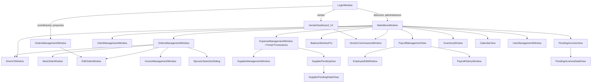
```mermaid
graph TB
    LW[LoginWindow] -->|direccion, administracion| MM[MainMenuWindow]
    LW -->|coordinacion, proyectos| OMW2[OrdersManagementWindow]
    LW -->|ventas| VD[VendorDashboard_V2]

    MM --> OMW[OrdersManagementWindow]
    MM --> CMW[ClientManagementWindow]
    MM --> EMW[ExpenseManagementWindow / Portal Proveedores]
    MM --> PMV[PayrollManagementView]
    MM --> BWP[BalanceWindowPro]
    MM --> VCW[VendorCommissionsWindow]
    MM --> PIV[PendingIncomesView]
    MM --> DV[DriveV2Window]
    MM --> IW[InventoryWindow]
    MM --> CV[CalendarView]
    MM --> UMW[UserManagementWindow]

    OMW --> NOW[NewOrderWindow]
    OMW --> EOW[EditOrderWindow]
    OMW --> IMW[InvoiceManagementWindow]
    OMW --> ESD[EjecutorSelectionDialog]
    OMW --> DV

    EMW --> SMW[SupplierManagementWindow]
    EMW --> SPV[SupplierPendingView]
    SPV --> SPDV[SupplierPendingDetailView]

    PMV --> EEW[EmployeeEditWindow]
    PMV --> PHW[PayrollHistoryWindow]

    PIV --> PIDV[PendingIncomesDetailView]

    OMW2 --> EOW

    VD --> VCW
```

**Ventana unica (Fase 4)**: al abrir un modulo se cierra el menu y solo queda la ventana del modulo en la taskbar. Al cerrar el modulo, `MainMenuWindow` reaparece. Aplica a los 10 modulos principales.
