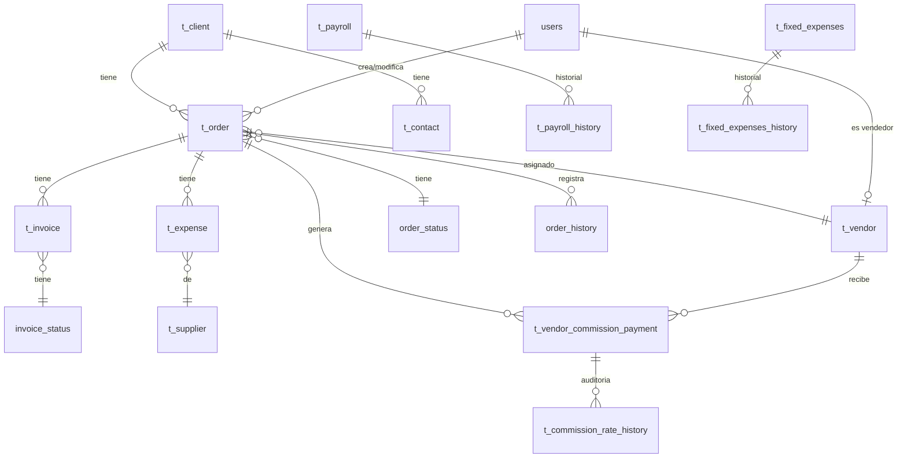

# Relaciones y Foreign Keys - IMA Mecatrónica

**Fecha de extracción:** _Pendiente_

---

## Foreign Keys (Sección 3)

_Pegar resultado de Sección 3 aquí_

```
| tabla_origen | columna_origen | tabla_destino | columna_destino | nombre_fk | on_delete | on_update |
|--------------|----------------|---------------|-----------------|-----------|-----------|-----------|
```

---

## Diagrama de Relaciones (ERD)



---

## Relaciones por Módulo

### Módulo de Órdenes

```
t_order
├── → t_client (f_client)
├── → t_contact (f_contact)
├── → t_vendor (f_salesman)
├── → order_status (f_orderstat)
├── → users (created_by, updated_by)
├── ← t_invoice (f_order)
├── ← t_expense (f_order)
├── ← t_vendor_commission_payment (f_order)
└── ← order_history (f_order)
```

### Módulo de Facturación

```
t_invoice
├── → t_order (f_order)
├── → invoice_status (f_invoicestat)
└── → users (created_by)
```

### Módulo de Gastos

```
t_expense
├── → t_supplier (f_supplier)
├── → t_order (f_order) [opcional]
└── → users (created_by)
```

### Módulo de Comisiones

```
t_vendor_commission_payment
├── → t_vendor (f_vendor)
├── → t_order (f_order)
├── → users (created_by, updated_by)
└── ← t_commission_rate_history (commission_payment_id)
```

### Módulo de Nómina

```
t_payroll
├── → users (created_by, updated_by)
└── ← t_payroll_history (f_payroll)
```

---

## Reglas de Integridad Referencial

### ON DELETE CASCADE

_Listar FKs con cascade aquí_

### ON DELETE SET NULL

| FK | Tabla | Razón |
|----|-------|-------|
| `t_commission_rate_history_commission_payment_id_fkey` | t_commission_rate_history | Preserva historial cuando se elimina comisión |

### ON DELETE RESTRICT (default)

_Listar FKs que previenen eliminación_

---

## Notas sobre Relaciones

1. **order_history** tiene CASCADE desde t_order - se elimina historial con la orden
2. **t_commission_rate_history** tiene SET NULL - preserva auditoría
3. **t_order_deleted** NO tiene FK - es tabla de auditoría independiente

---

## Tablas sin FK (standalone)

- `app_versions` - Control de versiones
- `order_status` - Catálogo
- `invoice_status` - Catálogo
