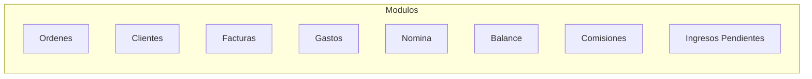

# Documentacion Tecnica - Sistema de Gestion de Proyectos

## IMA Mecatronica - Version 1.0.9

---

## Indice de Documentacion

| Documento | Descripcion |
|-----------|-------------|
| [01_ARQUITECTURA.md](./01_ARQUITECTURA.md) | Vision general de la arquitectura, patrones de diseno, estructura de carpetas |
| [02_MODELOS_DATOS.md](./02_MODELOS_DATOS.md) | Esquema de base de datos, modelos ORM, relaciones entre entidades |
| [03_SERVICIOS.md](./03_SERVICIOS.md) | Documentacion de todos los servicios, metodos y flujos |
| [04_ROLES_AUTENTICACION.md](./04_ROLES_AUTENTICACION.md) | Sistema de roles, permisos, autenticacion y seguridad |
| [05_FLUJOS_TRABAJO.md](./05_FLUJOS_TRABAJO.md) | Flujos de trabajo, ciclos de vida, procesos de negocio |

---

## Resumen Ejecutivo

### Stack Tecnologico

| Componente | Tecnologia |
|------------|------------|
| Framework | .NET 8.0 (WPF) |
| Lenguaje | C# |
| Base de Datos | Supabase (PostgreSQL) |
| ORM | Postgrest |
| Autenticacion | BCrypt |
| UI | XAML/WPF |

### Arquitectura

```
┌─────────────────────────────────────────────────────┐
│                    UI (Views/XAML)                  │
├─────────────────────────────────────────────────────┤
│                ViewModels (MVVM)                    │
├─────────────────────────────────────────────────────┤
│           SupabaseService (Facade)                  │
├─────────────────────────────────────────────────────┤
│  OrderService │ ClientService │ InvoiceService │...│
├─────────────────────────────────────────────────────┤
│              BaseSupabaseService                    │
├─────────────────────────────────────────────────────┤
│                 Supabase Client                     │
├─────────────────────────────────────────────────────┤
│                  PostgreSQL                         │
└─────────────────────────────────────────────────────┘
```

### Roles del Sistema

| Rol | Descripcion | Pantalla Inicial |
|-----|-------------|------------------|
| `admin` | Acceso total | MainMenuWindow |
| `coordinator` | Solo ordenes (sin financiero) | OrdersManagementWindow |
| `salesperson` | Solo sus comisiones | VendorDashboard |

### Modulos Principales



---

## Guia Rapida

### Requisitos
- .NET 8.0 Runtime
- Windows 10/11
- Conexion a Internet (Supabase)

### Configuracion
El archivo `appsettings.json` contiene:
```json
{
  "Supabase": {
    "Url": "https://xxx.supabase.co",
    "AnonKey": "eyJ..."
  },
  "SessionTimeout": {
    "Enabled": true,
    "InactivityMinutes": 15,
    "WarningBeforeMinutes": 2
  }
}
```

### Compilacion
```bash
dotnet build -c Release
dotnet publish -c Release -r win-x64 --self-contained false
```

### Instalador
```bash
"C:\Program Files (x86)\Inno Setup 6\ISCC.exe" installer.iss
```

---

## Patrones de Diseno Utilizados

1. **Singleton** - SupabaseService, SessionTimeoutService, JsonLoggerService
2. **Facade** - SupabaseService como punto unico de acceso
3. **Repository** - Servicios especializados por entidad
4. **MVVM** - Separacion View/ViewModel/Model
5. **Observer** - Eventos de timeout de sesion

---

## Contacto

**Desarrollado por:** Zuri Dev
**Empresa:** IMA Mecatronica
**Ano:** 2025
